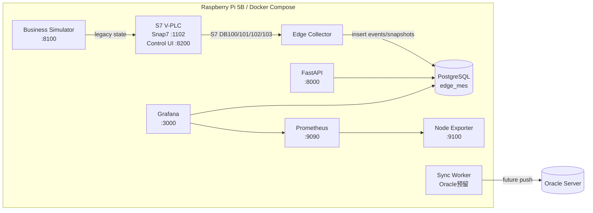
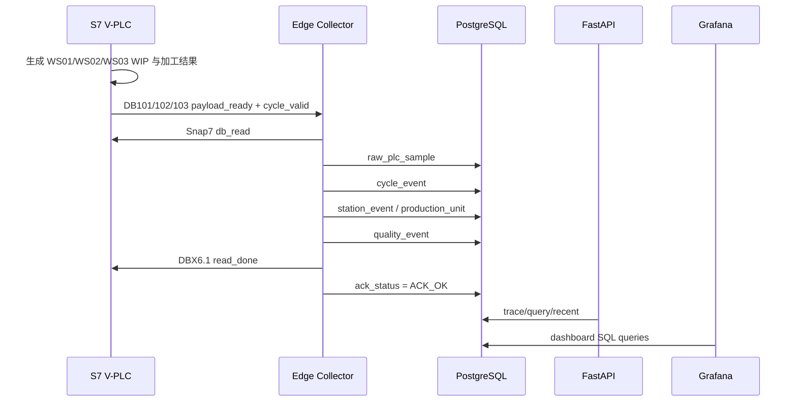

# Edge MES Demo 系统架构

更新时间：2026-06-16  
部署目标：Raspberry Pi 5B 8GB，SSD，Docker Compose  
项目目录：`/Users/chenjie/Documents/MES/edge-mes-demo`  
树莓派部署目录：`/opt/edge-mes-demo`

## 1. 系统目标

本项目是一个离线可运行的 Edge MES 数据采集与展示 Demo。当前目标不是替代完整 MES，而是先搭建一套能在树莓派上运行的轻量系统，用于模拟 S7 PLC、采集三工站生产数据、落库、追溯和可视化。

核心能力：

- 模拟 Siemens S7 PLC 通讯，当前通过 Snap7 Server 暴露 DB 块。
- 模拟单条产线、一个 PLC、三个工站：WS01、WS02、WS03。
- Edge Collector 通过 S7 DB 读取工站数据并写入 PostgreSQL。
- PostgreSQL 本地存储事件、原始 PLC sample、质量事件、运行状态。
- FastAPI 提供 KPI、追溯、事件查询接口。
- Grafana 展示旧生产总览、树莓派主机监控、三工站追溯与采集监控。
- 预留 sync worker，将来由树莓派主动推送到远端 Oracle 服务器。

## 2. 服务拓扑

## 3. 容器服务

| Service | Container | Port | 作用 |
| --- | --- | --- | --- |
| `postgres` | `edge-mes-postgres` | 5432 | 本地业务数据库 |
| `simulator` | `edge-mes-simulator` | 8100 | 旧业务场景模拟与控制页 |
| `s7-plc-sim` | `edge-mes-s7-plc-sim` | 1102, 8200 | Snap7 PLC 模拟与 V-PLC 控制台 |
| `collector` | `edge-mes-collector` | internal | S7 读取、快照采集、事件采集 |
| `api` | `edge-mes-api` | 8000 | REST API、KPI SVG、追溯页面 |
| `grafana` | `edge-mes-grafana` | 3000 | Dashboard |
| `prometheus` | `edge-mes-prometheus` | 9090 | 主机监控数据采集 |
| `node-exporter` | `edge-mes-node-exporter` | 9100 | 树莓派 CPU/内存/磁盘指标 |
| `sync-worker` | `edge-mes-sync-worker` | internal | Oracle 同步预留，当前 mock |

## 4. 数据流

## 5. 数据库分层

### 旧快照链路

旧 dashboard 和旧 simulator 仍使用：

- `machines`
- `production_snapshot`
- `production_events`
- `alarm_events`
- `stop_events`
- `sync_outbox`

这些表保留是为了兼容已有 Grafana 单线生产总览。

### 新事件链路

三工站采集使用：

- `raw_plc_sample`：保存原始 DB bytes 的 hex 和 decoded JSON。
- `cycle_event`：每个工站每个 cycle 一条主事件，保留旧 API/Grafana 兼容字段。
- `station_event`：按 `unit_id` 追加的工站履历。
- `production_unit`：按 `unit_id` 维护的工件当前状态，支持已完成合格、进行中、不合格分组。
- `unit_state_history`：工件状态变化记录。
- `quality_event`：由 cycle_event 派生质量事件。
- `collector_runtime_status`：每个工站的 Collector 连接与采集状态。
- `collector_error_log`：Collector 错误日志预留。
- `data_gap_event`：Ignore Edge / Bypass 数据缺口预留。

## 6. 外部访问入口

| URL | 用途 |
| --- | --- |
| `http://10.0.0.217:3000` | Grafana |
| `http://10.0.0.217:3000/d/edge-mes-overview` | 旧单线生产总览 |
| `http://10.0.0.217:3000/d/edge-mes-station-traceability` | 三工站追溯与采集监控 |
| `http://10.0.0.217:3000/d/raspberry-pi-host-monitor` | 树莓派主机监控 |
| `http://10.0.0.217:8000/trace` | 三工站追溯页面 |
| `http://10.0.0.217:8200/vplc` | V-PLC 控制台 |
| `http://10.0.0.217:8100/control` | 旧场景控制台 |

## 7. 当前架构约束

- 当前只考虑单台设备、单条产线、单个 PLC。
- 本地数据库采用 PostgreSQL；远端 Oracle 只作为未来同步目标，不在本地直接使用 Oracle。
- 系统需要离线运行；外部网络不是运行前提。
- 旧 `DB100` 仍兼容旧 dashboard，不代表最终 PLC 线级 DB 语义。
- 新三工站 V-PLC 使用 `DB101/102/103`，并已经从旧 simulator 随机停机信号解耦。
- 追溯主关联键是 `unit_id`；`SUB/ASM/NG/序号` 只是查询入口。
- V-PLC 未收到 ACK 前不启动同工站下一件，防止 payload 被覆盖。
- Grafana 适合工程监控和调试，不作为最终数字孪生首页的唯一方案。
- 未来自研 dashboard 可以在 Grafana 之外实现，用于 3D、动画、产线孪生首页。
