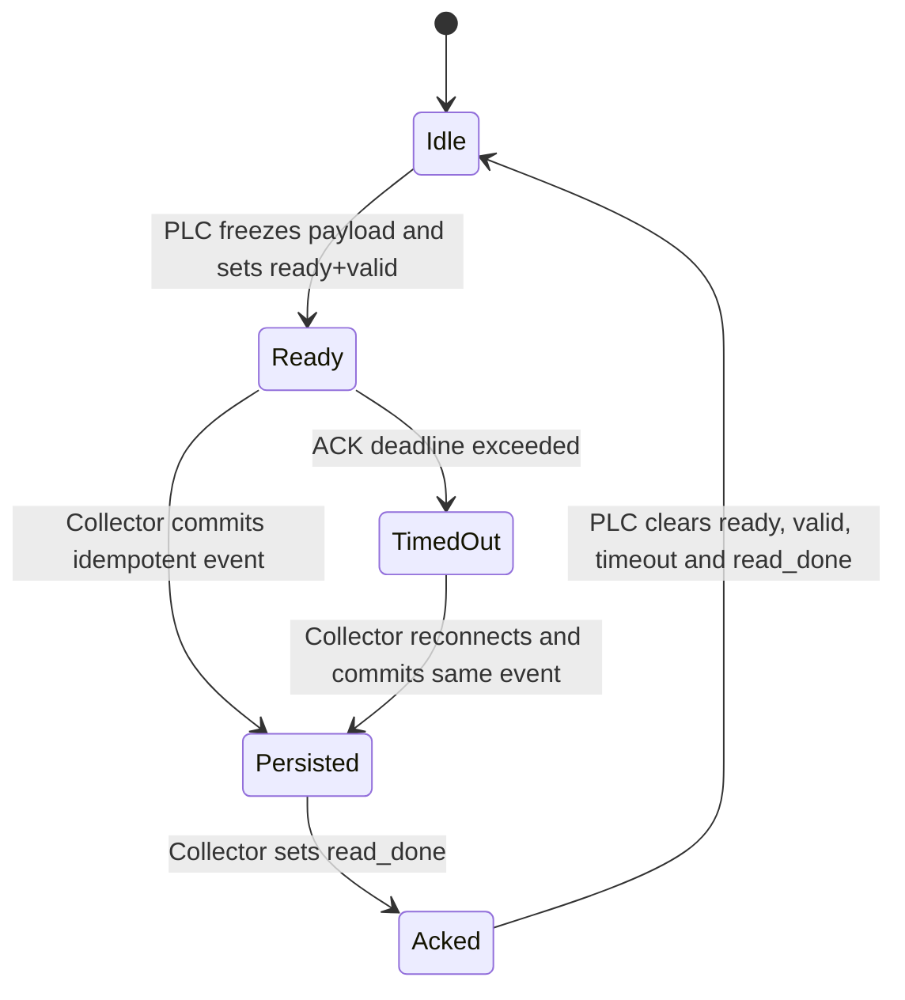

# ACK Protocol Contract

更新时间：2026-06-18  
适用范围：当前单机 V-PLC Demo 的 DB101/DB102/DB103。

## 1. 目的

本文件冻结 Reliability、Data Quality 和 Verification Thread 共同使用的 ACK
语义。它补充 [`../protocol.md`](../protocol.md)，不替代面向真实 PLC 的
[`../plc_edge_integration_guide.md`](../plc_edge_integration_guide.md)。

## 2. 当前实现

| 字段 | 地址 | 写入方 | 当前行为 |
| --- | --- | --- | --- |
| `payload_ready` | `{db}.DBX6.0` | V-PLC | payload 完成后置位 |
| `read_done` | `{db}.DBX6.1` | Collector | 数据落库后置位 |
| `ack_timeout` | `{db}.DBX6.2` | V-PLC | 已定义但当前始终为 `FALSE` |
| `cycle_valid` | `{db}.DBX6.3` | V-PLC | 有效 cycle payload 时置位 |

当前默认 `require_ack=false`。V-PLC 在约 10 秒后可自动清除未 ACK payload。
该行为只适合演示，不是本阶段的目标可靠性语义。

## 3. Phase-1 目标状态机



必须满足：

1. V-PLC 最后写 `payload_ready=TRUE`，此前 payload、counter、时间和结果必须稳定。
2. `payload_ready=TRUE` 期间，同一工站不得发布下一件或覆盖当前 payload。
3. Collector 只有在数据库事务成功提交后才能写 `read_done=TRUE`。
4. 数据库幂等键为：

   ```text
   plc_id + station_id + plc_boot_id + cycle_counter
   ```

5. 重复读取同一 payload 允许更新同一事件，不得生成第二条 cycle。
6. ACK 超时后 V-PLC 设置 `ack_timeout=TRUE`，但不得自动清除或覆盖 payload。
7. Collector 恢复后重新读取、幂等落库并补写 `read_done`。
8. V-PLC 收到 `read_done` 后清除四个握手位，再允许下一件。

## 4. 数据库状态

`cycle_event.ack_status` 使用以下值：

| 状态 | 含义 |
| --- | --- |
| `PENDING` | 事件已落库，尚未确认 PLC 写回成功 |
| `ACK_OK` | `read_done` 写回成功 |
| `ACK_WRITE_FAILED` | 数据已落库，但写回失败，允许重试 |

`retry_count` 仅统计 ACK 写回重试。连接、读取和解码错误写入
`collector_error_log`，不能伪装成 `ACK_OK`。

## 5. 超时与恢复

- Demo 默认 ACK deadline：10 秒，可通过配置调整。
- 超时只改变 `ack_timeout` 和告警状态，不释放 payload。
- Collector 重启后不依赖内存状态；它应从 PLC 当前 payload 和数据库唯一键恢复。
- 如果数据库提交成功但 ACK 写回失败，下一轮必须先识别已有事件，再补 ACK。
- 如果 `read_done=TRUE` 但数据库中没有对应事件，Verification 应判定为严重错误。

## 6. Thread 边界

- Reliability Thread：实现状态机、重试和错误记录。
- Data Quality Thread：只消费 ACK 状态，不改变 ACK 协议。
- Verification Thread：覆盖正常 ACK、重复读取、写回失败、Collector 重启和超时恢复。
- 本阶段不引入生产 PLC 指南中的 `ack_counter/ack_valid` 新地址；那属于后续协议升级。
- Oracle / `sync-worker` 与 ACK 成功无关，属于 Phase-2 Out of Scope。

## 7. 验收条件

- 未 ACK payload 不被覆盖。
- 同一幂等键只有一个 `cycle_event`。
- 数据库失败时不写 ACK。
- ACK 写失败时事件保留且可重试。
- Collector 重启后可补 ACK。
- 超时后 payload 仍可恢复。
