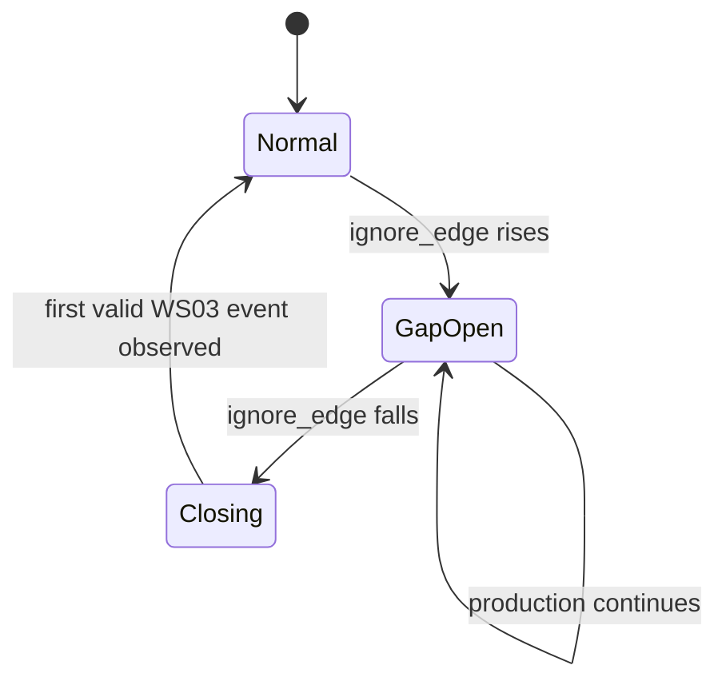

# Data Gap Event Contract

更新时间：2026-06-18  
适用范围：当前单线 Demo 的 Ignore Edge / Bypass 和 counter 缺口。

## 1. 目的

定义 `data_gap_event` 何时创建、如何关闭、如何计算缺件，以及三个 Thread 对该表
的共同解释。

## 2. 数据来源

- 线级 Ignore Edge：`DB104.DBX52.3 ignore_edge`。
- 工站事件 identity：`plc_id + station_id + plc_boot_id + cycle_counter`。
- 当前 gap 主观察站：`WS03`，因为它代表最终下线事件。
- 当前 schema：`db/init/003_event_schema.sql` 中的 `data_gap_event`。

## 3. Gap 原因

`reason` 使用稳定代码：

| reason | 触发条件 |
| --- | --- |
| `EDGE_BYPASS` | `ignore_edge` 从 FALSE 变为 TRUE |
| `COUNTER_JUMP` | 同 boot 下相邻已接受 counter 差值大于 1 |
| `PLC_COUNTER_RESET` | 同 boot 下 counter 下降 |
| `COLLECTOR_OFFLINE` | 可证明 Collector 离线区间导致缺失 |

本阶段优先完成 `EDGE_BYPASS` 和 `COUNTER_JUMP`。不能证明原因时不得猜测。

## 4. Ignore Edge 状态机



规则：

1. `ignore_edge` 上升沿创建一条 open gap。
2. 线级 gap 在表中使用 `station_id='WS03'`，用于最终产出缺口计算。
3. `start_cycle_counter` 记录 bypass 前最后一个已持久化 WS03 counter。
4. `start_time` 记录 Edge 观察到上升沿的时间。
5. bypass 期间不把猜测数据补成 cycle event。
6. `ignore_edge` 下降后，等待第一个有效 WS03 事件，再关闭 gap。
7. `end_cycle_counter` 记录恢复后的第一个有效 WS03 counter。
8. `end_time` 记录该恢复事件被读取的时间。

## 5. Missing Count

同一个 `plc_boot_id` 内：

```text
missing_count = max(0, end_cycle_counter - start_cycle_counter - 1)
```

恢复后的第一个有效事件会正常写入 `cycle_event`，因此不计入 missing。

如果 boot ID 在 gap 中变化，或 counter reset：

- 不使用上述公式。
- `missing_count=0` 表示数量未知，不表示没有缺失。
- 创建或补充 `PLC_COUNTER_RESET` gap。
- 验证报告必须说明数量无法精确推导。

## 6. Label 边界

- `last_label_code`：gap 前最后一个已持久化 WS03 label。
- `current_label_code`：恢复后的第一个有效 WS03 label。
- label 只作为人类检查入口，不作为 missing_count 的唯一计算依据。
- label 不连续但 counter 连续时，记录数据质量警告，不自动制造 gap。

## 7. 幂等与恢复

- 每条线同时最多存在一条 `reason='EDGE_BYPASS'` 且 `end_time IS NULL` 的 open gap。
- Collector 重启后应查询 open gap 并继续关闭流程。
- 重复观察同一上升沿不得插入第二条 open gap。
- 重复处理恢复事件不得重复关闭或增加 missing_count。
- gap 记录不得修改或伪造相邻 `cycle_event`。

## 8. API 与 Dashboard 最小输出

至少展示：

- `reason`
- `start_time` / `end_time`
- `start_cycle_counter` / `end_cycle_counter`
- `missing_count`
- `last_label_code` / `current_label_code`
- open/closed 状态（可由 `end_time IS NULL` 推导）

Trace API 遇到 gap 时应显示缺口边界，不应按时间猜测缺失工站事件。

## 9. Thread 边界

- Reliability Thread：提供稳定 DB104 identity、ignore bit 和 counter 语义。
- Data Quality Thread：实现 gap 创建、关闭、查询和展示。
- Verification Thread：验证 bypass、counter jump、重启恢复和幂等。
- Oracle / `sync-worker` 不消费或同步 gap，属于 Phase-2 Out of Scope。

## 10. 验收条件

- bypass 上升沿只创建一个 open gap。
- bypass 下降后由第一个有效 WS03 事件关闭。
- missing_count 公式与测试 counter 一致。
- Collector 重启不会丢失或复制 open gap。
- Trace/Grafana 能显示 gap，不伪造 cycle。
