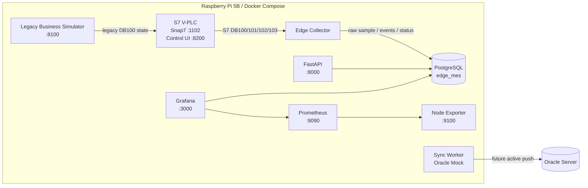
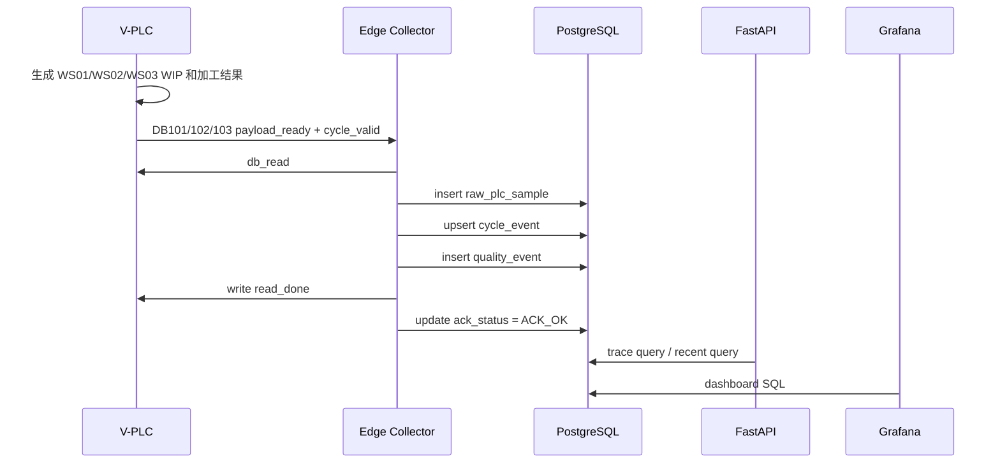
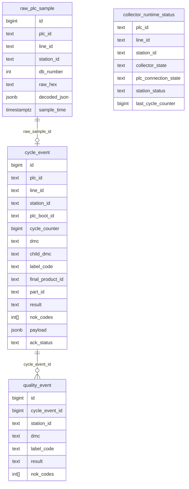

# Edge MES Demo 技术方案与软件需求规格说明

更新时间：2026-06-17  
适用阶段：V-PLC + Edge Collector + PostgreSQL + FastAPI + Grafana Demo  
部署目标：Raspberry Pi 5B，8GB RAM，SSD，Docker Compose  
本地项目目录：`/Users/chenjie/Documents/MES/edge-mes-demo`  
树莓派部署目录：`/opt/edge-mes-demo`

## 1. 文档目标

本文档用于固化当前 Edge MES Demo 的技术方案和软件需求，作为后续开发、部署、验证、恢复上下文和真实 PLC 接入前评审的主要依据。

本系统当前不是完整 MES 的替代品，而是一套轻量边缘采集系统 Demo。它的目标是先在树莓派上离线运行，模拟 Siemens S7 PLC 通讯，采集单条产线三工站数据，完成本地存储、追溯、工程监控，并为未来主动同步到远端 Oracle 服务器预留架构。

后续系统定位为轻量级 Edge SCADA + 产线级 MES 节点。树莓派负责靠近设备侧的数据采集、短期存储、追溯、参数管控、报警、权限、归档调度和本地展示；高频原始采集、长期大数据分析、AI 重计算、图片/视频长期存储由外部设备或服务器承担。

## 2. 背景与目标

现有 MES 系统功能较完整，但在部分小型设备、单线设备或离线场景下可能显得过重。本项目希望验证一套更轻量的边缘数据采集方案：

- 不依赖外部服务器即可采集、记录和查看生产数据。
- 在没有真实 PLC 硬件的 Demo 阶段，通过 V-PLC 模拟尽量接近真实 S7 DB 通讯。
- 在边缘侧完成基础追溯、质量事件、产能和设备状态监控。
- 保留未来将本地数据主动推送到 Oracle 服务端的能力。
- 后续可扩展自研 dashboard 和数字孪生首页。

## 3. 范围

### 3.1 当前范围

当前版本覆盖以下内容：

- 单台设备、单条产线、单个 PLC。
- 三个工站：
  - WS01 Screw Station
  - WS02 EOL Test Station
  - WS03 Label / Final Station
- V-PLC 通过 Snap7 Server 暴露 DB100、DB101、DB102、DB103。
- Edge Collector 通过 Snap7 Client 读取 DB 块。
- 本地 PostgreSQL 存储原始 PLC sample、cycle event、quality event 和 collector runtime status。
- FastAPI 提供追溯页面和查询 API。
- Grafana 提供工程监控 dashboard。
- Prometheus + node-exporter 提供树莓派主机监控。
- Sync worker 当前为 mock，作为 Oracle 主动同步预留。

### 3.2 后续扩展范围

后续版本计划覆盖以下内容：

- 最多 3 条流水线。
- 参数管理：
  - Edge 读取和校验参数。
  - Edge 不主动回写 PLC。
  - PLC 侧参数修改后通知 Edge 读取。
  - 被授权账号登录后即可修改参数，不需要审批流。
  - 系统记录精确 changelog。
- MCU 高频文件接入：
  - 高频采集由 MCU 或专用采集器完成。
  - MCU 每个零件生成一个 CSV 或 JSON 文件。
  - Edge 负责抓取、解析、特征提取、分析和归档。
- 工业相机图片/视频接入：
  - 来源为工业相机。
  - 本地默认保留 7 天，可配置。
  - 超期后归档或删除。
- 归档与冷热备份：
  - 支持移动硬盘冷备份。
  - 支持上传服务器热备份。
  - 两种目标均作为可勾选任务。
  - 支持按月或按季度强制归档。
- 权限和认证：
  - 支持用户、角色、令牌。
  - 支持人脸识别模块或指纹模块等生物识别外设。
  - 参数修改、配置变更和归档任务必须记录操作审计。
- AI 结果接入：
  - Nvidia 边缘设备或其他外部算力负责 AI 推理。
  - Edge 接收 AI 结果，并关联 `unit_id`、工站事件和媒体文件。

### 3.3 当前不包含

当前版本暂不包含：

- 真实 Siemens PLC 硬件接入。
- 生产级权限、用户、审计。
- Oracle 实际同步。
- 完整 OEE、排班、工单、工艺路线、物料管理。
- 3D 设备模型、动画物料流、数字孪生首页。
- 高可用、集群部署、云端管理。
- 电子 SOP。
- 维护保养模块。
- 树莓派直接进行高频原始信号采样。
- 树莓派长期保存图片/视频。
- 树莓派执行 AI 模型训练或重推理。

## 4. 总体架构



### 4.1 服务清单

| Service | Container | Port | 说明 |
| --- | --- | --- | --- |
| `postgres` | `edge-mes-postgres` | 5432 | 本地 PostgreSQL 数据库 |
| `simulator` | `edge-mes-simulator` | 8100 | 旧业务模拟和旧控制页面 |
| `s7-plc-sim` | `edge-mes-s7-plc-sim` | 1102, 8200 | S7 V-PLC 和控制台 |
| `collector` | `edge-mes-collector` | internal | DB 读取、事件采集、快照采集 |
| `api` | `edge-mes-api` | 8000 | FastAPI、追溯页面、查询接口 |
| `grafana` | `edge-mes-grafana` | 3000 | 工程 dashboard |
| `prometheus` | `edge-mes-prometheus` | 9090 | 主机监控指标存储 |
| `node-exporter` | `edge-mes-node-exporter` | 9100 | 树莓派主机指标采集 |
| `sync-worker` | `edge-mes-sync-worker` | internal | Oracle 同步预留，当前 mock |

## 5. 数据流



## 6. 关键设计决策

| 编号 | 决策 | 当前理由 |
| --- | --- | --- |
| D01 | 本地数据库使用 PostgreSQL | 轻量、稳定、易部署，适合树莓派本地存储 |
| D02 | 远端 Oracle 只作为未来同步目标 | 边缘端保持离线可运行，避免本地直接依赖 Oracle |
| D03 | 保留 DB100 旧快照链路 | 不破坏旧 dashboard 和已有 demo 能力 |
| D04 | 新三工站使用 DB101/102/103 | 与旧 DB100 解耦，减少协议冲突 |
| D05 | V-PLC 使用 Snap7 Server | Demo 阶段尽量贴近真实 S7 DB 通讯 |
| D06 | 三工站为并行 WIP | 更接近真实流水线，不采用单线程顺序模拟 |
| D07 | 追溯优先使用 `unit_id` | 避免并行 WIP 下按时间、序号或 DMC 尾号误配 |
| D08 | Grafana 作为工程监控 | 快速可视化和调试，但不作为最终数字孪生首页 |
| D09 | 默认不强制 ACK | Demo 阶段避免系统因 ACK 异常停死 |
| D10 | 系统必须离线运行 | 满足现场网络不可用或服务器不可达场景 |
| D11 | 高频采集由 MCU 完成 | 树莓派只处理每件生成的 CSV/JSON 文件 |
| D12 | 参数管理只读校验 | Edge 不主动回写 PLC，降低误写风险 |
| D13 | 图片/视频短期缓存 | 工业相机媒体默认本地保留 7 天，长期进入归档 |
| D14 | AI 外部算力执行 | Nvidia 边缘设备或服务器负责推理和长期分析 |

## 7. PLC 通讯协议需求

### 7.1 通讯参数

| 项 | 当前值 |
| --- | --- |
| Protocol | Siemens S7 / Snap7 |
| V-PLC Host | `s7-plc-sim`，外部 `10.0.0.217` |
| V-PLC Port | `1102` |
| Rack | `0` |
| Slot | `1` |
| Collector Poll Interval | 默认 `500ms` |
| Mapping File | `config/mapping.yaml` |

真实 S7 PLC 常用 102 端口。当前 Demo 使用 1102，避免权限和端口冲突。真实 PLC 接入前需要根据现场 PLC 地址、rack、slot、DB 地址重新确认 mapping。

### 7.2 DB 块职责

| DB | 作用 | 当前状态 |
| --- | --- | --- |
| DB100 | 线级状态 / legacy dashboard 兼容 | 保留旧链路，语义与新协议未完全统一 |
| DB101 | WS01 Screw Station | 已用于事件采集 |
| DB102 | WS02 EOL Test Station | 已用于事件采集 |
| DB103 | WS03 Label / Final Station | 已用于事件采集 |

### 7.3 工站公共 Header

DB101、DB102、DB103 共享以下 header：

| 字段 | 地址模板 | 类型 | 说明 |
| --- | --- | --- | --- |
| `station_status` | `{db}.DBW0` | word | 工站状态 |
| `cycle_counter` | `{db}.DBD2` | dint | 工站 cycle 计数 |
| `payload_ready` | `{db}.DBX6.0` | bool | PLC 数据已准备好 |
| `read_done` | `{db}.DBX6.1` | bool | Edge 已读取并确认 |
| `ack_timeout` | `{db}.DBX6.2` | bool | ACK 超时标志 |
| `cycle_valid` | `{db}.DBX6.3` | bool | 当前 payload 是否为有效 cycle |
| `plc_start_time` | `{db}.DBD8` | unix seconds | Cycle 开始时间 |
| `plc_end_time` | `{db}.DBD12` | unix seconds | Cycle 结束时间 |
| `result` | `{db}.DBW16` | word | UNKNOWN/OK/NOK/SKIPPED |
| `nok_code_count` | `{db}.DBW18` | word | NOK code 数量，最多 3 |
| `nok_codes[0..2]` | `{db}.DBW20/22/24` | word | NOK code 列表 |
| `alarm_code` | `{db}.DBW26` | word | 工站报警码 |
| `downtime_type` | `{db}.DBW28` | word | 停机类型 |
| `pallet_id_numeric` | `{db}.DBD30` | dint | 当前用作 serial/pallet numeric |
| `station_dmc` | `{db}.DBB40` | string(40) | 工站 DMC / label |

### 7.4 工站 Payload

WS01 写入螺丝扭矩和角度数据。WS02 写入 EOL 电流、电压、测试时长、上游 WS01 时间、结果和子件 DMC。WS03 写入最终序号、产品型号、上游 WS02 时间、结果和子件 DMC。

当前关键追溯字段：

| 工站 | 字段 | 地址 | 说明 |
| --- | --- | --- | --- |
| WS01 | `station_dmc` | DB101.DBB40 | 子件 DMC，例如 `SUB-000006` |
| WS02 | `upstream_child_dmc` | DB102.DBB130 | 继承 WS01 子件 DMC |
| WS03 | `station_dmc` | DB103.DBB40 | 最终总成 ID，例如 `ASM-000006` |
| WS03 | `upstream_child_dmc` | DB103.DBB112 | 继承上游子件 DMC |
| WS03 | `upstream_ws02_dmc` | DB103.DBB154 | 记录 WS02 DMC |

## 8. 功能需求

### FR-01 V-PLC 模拟

系统应提供一个 V-PLC，用于在无真实 PLC 硬件时模拟 Siemens S7 DB 通讯。

验收标准：

- V-PLC 能注册 DB100、DB101、DB102、DB103。
- Collector 能通过 Snap7 Client 读取这些 DB。
- 控制台可查看整线状态、三工站状态、WIP、counter、当前 DMC、最近 DMC。

### FR-02 三工站并行 WIP

系统应模拟 WS01、WS02、WS03 的并行流水线流转。

验收标准：

- WS01 生成 `SUB-xxxxxx`。
- WS02 仅处理 WS01 OK 后进入 WIP 的产品。
- WS03 仅处理 WS02 OK 后进入 WIP 的产品。
- WS03 生成 `ASM-xxxxxx` 并保留上游 `SUB-xxxxxx`。

### FR-03 工站参数控制

系统应允许用户在 V-PLC 控制台调整各工站参数。

验收标准：

- 可设置基准节拍、波动、NOK 率。
- 可暂停和恢复单个工站。
- 可强制下一件 NOK。
- 可按连续、时长、件数、班次数启动生产计划。

### FR-04 Edge Collector 采集

系统应周期性读取 V-PLC DB 数据并写入本地数据库。

验收标准：

- Collector 能读取 DB101/102/103。
- 当 `payload_ready=true` 且 `cycle_valid=true` 时写入事件。
- 每次事件保存 raw sample 和 decoded payload。
- 写回 `read_done` 并更新 `ack_status=ACK_OK`。

### FR-05 本地事件存储

系统应在 PostgreSQL 中保存采集数据。

验收标准：

- 原始数据进入 `raw_plc_sample`。
- 工站 cycle 进入 `cycle_event`。
- 质量结果进入 `quality_event`。
- Collector 状态进入 `collector_runtime_status`。
- 旧快照链路继续写入 `production_snapshot`，不被破坏。

### FR-06 产品追溯

系统应支持通过总成 ID、子件 DMC 或序号查询三工站追溯。

验收标准：

- 查询 `ASM-000006` 可返回 WS01、WS02、WS03。
- 查询 `SUB-000006` 可返回 WS01、WS02、WS03。
- 查询 `6` 可解析到相关记录。
- 追溯优先使用明确 DMC 链路，不应把相邻件错配为同一件。
- 如果采集缺站，应显示缺失，而不是用时间近似强行补全。

### FR-07 最近记录分类

追溯页面下方应按产品状态分类展示最近记录。

验收标准：

- 支持已完成合格、进行中、不合格三栏。
- 支持最近 10、20、30 条切换。
- 点击记录可进入对应追溯查询。

### FR-08 Grafana 工程监控

系统应提供 Grafana dashboard 用于工程调试和状态观察。

验收标准：

- 三工站 dashboard 显示产出、合格率、cycle time、NOK、ACK、Collector 状态。
- 树莓派主机 dashboard 显示 CPU、内存、磁盘、温度等。
- Grafana 变量应正确展开，不应因工站变量带引号导致大面积无数据。

### FR-09 Oracle 同步预留

系统应保留由树莓派主动推送数据到远端 Oracle 的架构。

范围状态：**Phase-2 Out of Scope**。

当前验收标准：

- 存在 `sync-worker` 服务。
- 存在本地 outbox 或可扩展同步数据来源。
- 当前必须保持 mock，不要求也不实施真实 Oracle 连接。

## 9. 非功能需求

### NFR-01 离线运行

系统应在无外部网络、无远端服务器连接时继续运行。Oracle 同步失败不应影响本地采集、落库、追溯和 dashboard。

### NFR-02 资源占用

系统应能在 Raspberry Pi 5B 8GB + SSD 上长期运行。当前 Demo 服务数量和数据量适合该硬件，但后续需要关注 PostgreSQL 数据保留策略和 Grafana 查询复杂度。

### NFR-03 数据可靠性

系统应避免因 PLC 或 collector 重启造成历史事件覆盖。当前已使用 collector 会话 boot id 作为 `plc_boot_id` 兜底，后续应升级为真实 PLC/V-PLC retained boot id。

### NFR-04 可恢复性

系统应使用 Docker Compose 管理服务，容器应具备 `restart: unless-stopped`。核心配置、协议、状态和决策应保存在 `docs/` 中，便于 Codex 或开发人员恢复上下文。

### NFR-05 可维护性

PLC mapping 应集中在 `config/mapping.yaml`。真实 PLC 接入时，应优先修改 mapping 和连接配置，而不是在采集代码中硬编码地址。

## 10. 数据模型



关键表：

- `raw_plc_sample`：保存原始 DB bytes 和 decoded JSON，便于问题追查。
- `cycle_event`：工站 cycle 主表，是追溯和 dashboard 的核心数据源。
- `quality_event`：质量事件派生表。
- `collector_runtime_status`：展示 collector 是否在线、PLC 是否连接、工站状态。
- `data_gap_event`：数据缺口预留，后续用于 Ignore Edge / Bypass。

## 11. 外部访问入口

| URL | 用途 |
| --- | --- |
| `http://10.0.0.217:3000` | Grafana |
| `http://10.0.0.217:3000/d/edge-mes-overview` | 旧单线生产总览 |
| `http://10.0.0.217:3000/d/edge-mes-station-traceability` | 三工站追溯与采集监控 |
| `http://10.0.0.217:3000/d/raspberry-pi-host-monitor` | 树莓派主机监控 |
| `http://10.0.0.217:8000/trace` | 三工站追溯页面 |
| `http://10.0.0.217:8200/vplc` | V-PLC 控制台 |
| `http://10.0.0.217:8100/control` | 旧场景控制台 |

## 12. 重要约束

- 当前系统只考虑单台设备、单条产线、单个 PLC。
- 当前树莓派为 8GB RAM，系统运行在 SSD 上。
- 系统必须离线可运行。
- 不要删除或破坏旧 DB100、`production_snapshot`、`edge_mes_overview`。
- `config/plc_mapping.yaml` 是旧 DB100 映射。
- `config/mapping.yaml` 是新三工站协议映射。
- DB100 当前存在 legacy 兼容，不应直接假设已经完全符合新协议。
- V-PLC 当前端口为 1102；真实 PLC 通常可能使用 102。
- 当前 ACK 默认非强制，适合 Demo；真实模式需要单独启用和验证。
- 当前 API/Grafana 没有生产级权限控制。
- 当前 Oracle 同步仍是 mock。
- 追溯宁可显示缺站，也不应为了看起来完整而错配相邻件。

## 13. 已完成能力

- 树莓派 Docker Compose 离线部署。
- V-PLC Snap7 Server。
- 三工站并行 WIP。
- 三工站 DB101/102/103 事件协议。
- WS01/WS02/WS03 上游 DMC 传递。
- Edge Collector S7 采集。
- PostgreSQL 事件模型。
- FastAPI 追溯 API 和页面。
- 追溯页面三栏分类和最近 10/20/30 条切换。
- Grafana 三工站工程 dashboard。
- 树莓派主机监控 dashboard。
- Collector 会话 boot id 兜底，避免 counter 回绕覆盖历史。
- 文档体系：architecture、protocol、task_plan、decisions、current_status。

## 14. 待完成事项

### 高优先级

1. 将 `plc_boot_id` 从 collector 会话兜底升级为真实 PLC/V-PLC retained boot id。
2. 实现真实 ACK timeout、重试、失败日志和报警。
3. 实现 counter reset / 回绕检测。
4. 实现 Ignore Edge / Bypass 与 `data_gap_event`。

### 中优先级

1. 追溯 API 增加缺站原因、采集缺口边界、raw sample drill-down。
2. Grafana 增加数据质量面板。
3. V-PLC 增加断线、写失败、ACK 失败、DB 异常模拟。
4. Collector 增加更完整错误日志和恢复策略。
5. 工站参数持久化，避免容器重启后配置丢失。
6. 参数管理与 changelog。
7. MCU CSV/JSON 高频文件接入与特征提取。
8. 工业相机图片/视频元数据与 7 天保留策略。
9. 归档任务管理，支持移动硬盘和服务器上传。

### 后续产品化

1. 自研 dashboard。
2. 数字孪生首页，展示 3D 设备、物料流、工站状态动画。
3. 用户权限、令牌认证、生物识别外设适配、操作审计。
4. 真实 PLC 接入演练和现场部署手册。
5. AI / Nvidia 边缘设备结果接入。

### 明确后置或排除

1. 电子 SOP 暂不需要。
2. 维护保养模块暂不需要。
3. 高频原始采样不由树莓派直接完成。
4. 图片/视频长期存储不放在树莓派本地。
5. 长期大数据分析和 AI 重计算放到其他设备或服务器。

## 15. 下一步执行顺序

建议后续按以下顺序推进：

1. 可靠性补强
   - retained `plc_boot_id`
   - ACK timeout
   - counter reset 检测
   - collector 重启恢复

2. 数据缺口与 Bypass
   - 启用整线 `ignore_edge`
   - 写入 `data_gap_event`
   - 按 WS03 label_code 计数字段计算缺件

3. 验证与回归
   - 建立 ACK、PLC identity、counter reset 和 data gap 测试矩阵
   - 验证单机离线 Demo 的端到端闭环
   - 输出 `docs/reports/` 验证报告

4. KPI 与数据质量
   - 固化产量、合格率、CT、停机、缺站、漏采等指标口径
   - 增加 Grafana 数据质量监控

5. 参数管理与 changelog
   - 参数定义
   - 参数快照
   - 参数读取和校验
   - PLC 参数修改通知
   - 精确变更日志

6. MCU 文件接入与特征提取
   - 每个零件一个 CSV/JSON 文件
   - 文件元数据
   - 解析状态
   - 特征提取
   - 与 `unit_id` / DMC / station_event 关联

7. 工业相机媒体与归档
   - 图片/视频元数据
   - 默认 7 天本地保留
   - 移动硬盘冷备份
   - 服务器热备份
   - 按月/季度归档

8. 权限认证
   - 用户和角色
   - 令牌验证
   - 人脸/指纹外设适配
   - 操作审计

9. 自研 dashboard
   - 保留 Grafana 作为工程监控
   - 新建面向操作员/管理层的前端首页
   - 后续承接数字孪生和 3D 展示

10. AI 结果接入
   - Nvidia 边缘设备推理
   - Edge 接收推理结果
   - 记录模型版本、缺陷类型、置信度和推理耗时

11. 真实 PLC 接入准备
   - 与真实 DB 地址表对齐
   - 先只读验证
   - 再启用 `read_done` 写回

## 16. 验收清单

每次阶段性发布至少验证：

- Docker 服务全部 running 或 healthy。
- V-PLC 控制台可打开。
- Collector 日志无持续异常。
- PostgreSQL 有新的 `cycle_event` 写入。
- 查询最新 `ASM` 能返回 WS01/WS02/WS03。
- Grafana dashboard 无大面积无数据。
- 树莓派主机监控正常刷新。
- 重启 collector 后不会覆盖旧 `cycle_event`。
- 文档同步更新到本地和树莓派部署目录。

## 17. 常用验证命令

树莓派：

```bash
cd /opt/edge-mes-demo
docker compose ps
docker logs --tail 80 edge-mes-collector
docker logs --tail 80 edge-mes-s7-plc-sim
docker exec edge-mes-postgres psql -U edge_mes -d edge_mes
```

本地：

```bash
cd /Users/chenjie/Documents/MES/edge-mes-demo
python3 -m compileall api/app collector/app s7_plc_sim/app
python3 -m json.tool config/grafana/dashboards/edge_mes_station_traceability.json
```

追溯 API：

```bash
curl 'http://10.0.0.217:8000/trace/api?q=ASM-000006'
curl 'http://10.0.0.217:8000/trace/api?q=SUB-000006'
curl 'http://10.0.0.217:8000/trace/api/recent?status=completed_ok&limit=10'
```

## 18. 附录：当前主要文件

| 文件 | 说明 |
| --- | --- |
| `docker-compose.yml` | 服务编排 |
| `config/mapping.yaml` | 新三工站 PLC 协议 |
| `config/plc_mapping.yaml` | 旧 DB100 协议 |
| `db/init/003_event_schema.sql` | 新事件表 |
| `s7_plc_sim/app/pipeline.py` | 三工站 WIP 模拟 |
| `collector/app/services/event_collector.py` | S7 事件采集 |
| `collector/app/services/storage.py` | 数据库存储 |
| `api/app/routes/trace.py` | 追溯 API 和页面 |
| `config/grafana/dashboards/edge_mes_station_traceability.json` | 三工站 dashboard |
| `docs/current_status.md` | Codex 恢复上下文 |
| `docs/edge_expansion_plan.md` | Edge SCADA/MES 扩展边界和阶段计划 |
| `docs/plc_edge_integration_guide.md` | 面向现场的通用 PLC/Edge 接入规范，覆盖 S7-300/S7-1200/S7-1500 |
