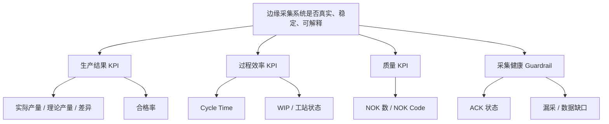

# Edge MES Demo KPI 口径与度量计划

更新时间：2026-06-19

适用范围：单台设备、单条产线、单个 PLC、WS01/WS02/WS03 三工站  
主要数据源：`cycle_event`、`quality_event`、`collector_runtime_status`、`raw_plc_sample`、`production_snapshot`

## 1. 目标

本文档定义 Edge MES Demo 当前和下一阶段 dashboard/API 使用的核心 KPI 口径。目标是让 Grafana、自研 dashboard、追溯页面和未来 Oracle 同步使用一致的指标定义，避免同一个字段在不同页面上出现不同解释。

当前 KPI 体系分为四类：

- 生产结果：产量、理论产量、产量差异、合格率。
- 过程效率：cycle time、产出节奏、WIP、工站等待。
- 质量异常：NOK 数、NOK code 分布、首件/末站质量。
- 采集健康：Collector 在线、ACK、漏采、数据缺口。

## 2. 指标分层



## 3. 核心口径

### KPI-01 实际产量

定义：在所选时间范围内，WS03 下线并判定为 OK 的最终产品数量。

推荐数据源：

```sql
SELECT count(*) AS actual_output
FROM cycle_event
WHERE station_id = 'WS03'
  AND result = 'OK'
  AND plc_end_time BETWEEN :start_time AND :end_time;
```

说明：

- 以 WS03 为整线最终下线点。
- 只统计 OK 件。
- NOK 件进入质量分析，不计入合格产出。

### KPI-02 理论产量

定义：所选时间范围内，按照理论节拍计算出的应产出数量。

基础公式：

```text
理论产量 = 有效生产秒数 / 理论节拍秒数
```

当前 Demo 建议：

- 默认理论节拍：`30s`。
- 后续可从 V-PLC 当前工站参数或产品配置表读取。
- 有效生产秒数应排除：
  - 班前开机时间
  - 班后清洁时间
  - 午餐/夜餐时间
  - 计划休息
  - 已确认计划停机

当前工程 dashboard 可先使用简化口径：所选时间窗秒数 / 30s。

### KPI-03 产量差异

定义：实际产量与理论产量的差值。

```text
产量差异 = 实际产量 - 理论产量
```

显示规则：

- 格式：`实际产量(理论产量) 差异值`
- 示例：`110(130) -20`
- 实际产量：
  - 低于理论值 5% 以上：红色
  - 高于理论值 5% 以上：紫色
  - 在 ±5% 范围内：绿色
- 理论产量：始终蓝色。
- 差异值：比实际/理论小 2 号；负数红色，非负绿色。

### KPI-04 合格率

定义：所选时间范围内，WS03 OK 件数占 WS03 总下线件数的比例。

```sql
SELECT
  count(*) FILTER (WHERE result = 'OK') AS ok_count,
  count(*) AS total_count,
  CASE
    WHEN count(*) = 0 THEN NULL
    ELSE round(100.0 * count(*) FILTER (WHERE result = 'OK') / count(*), 2)
  END AS yield_rate
FROM cycle_event
WHERE station_id = 'WS03'
  AND plc_end_time BETWEEN :start_time AND :end_time;
```

显示规则：

- 主值显示百分比，例如 `99.02%`。
- 角标显示 `合格数/总数`，例如 `101/102`。
- 不在 dashboard 内写说明文字，说明放入独立文档页。

### KPI-05 平均 Cycle Time

定义：所选时间范围内，指定工站或三工站的平均加工周期。

```sql
SELECT station_id, round(avg(cycle_time_ms) / 1000.0, 2) AS avg_cycle_time_s
FROM cycle_event
WHERE station_id IN (:stations)
  AND cycle_time_ms IS NOT NULL
  AND plc_end_time BETWEEN :start_time AND :end_time
GROUP BY station_id;
```

说明：

- 工程监控可显示三站平均值。
- 生产节拍判断建议优先看 WS03 下线节奏。
- 过程诊断时应分站展示 WS01/WS02/WS03，避免平均值掩盖瓶颈。

### KPI-06 实时产出曲线

定义：所选时间范围内，按 WS03 OK 下线时间累计的实际产出曲线。

口径：

- 横轴：时间。
- 纵轴：累计 OK 下线件数。
- 数据点来源：`cycle_event.station_id='WS03' AND result='OK'`。
- 每个合格件按 `plc_end_time` 形成阶梯式累计曲线。

理论曲线：

- 根据当前时间轴起止点计算。
- 按理论节拍生成累计理论产量。
- 不缩放纵轴口径；只缩放时间范围。

### KPI-07 NOK 事件数

定义：所选时间范围内，任一选定工站的 NOK cycle 数。

```sql
SELECT station_id, count(*) AS nok_count
FROM cycle_event
WHERE result = 'NOK'
  AND station_id IN (:stations)
  AND plc_end_time BETWEEN :start_time AND :end_time
GROUP BY station_id;
```

### KPI-08 NOK Code 分布

定义：所选时间范围内，NOK code 出现次数。

```sql
SELECT code::text AS nok_code, count(*) AS count
FROM cycle_event, unnest(nok_codes) AS code
WHERE result = 'NOK'
  AND station_id IN (:stations)
  AND plc_end_time BETWEEN :start_time AND :end_time
GROUP BY code
ORDER BY count DESC, code;
```

NOK code 范围：

| 范围 | 含义 |
| --- | --- |
| 10000-19999 | WS01 设备/工艺相关 |
| 20000-29999 | WS02 测试相关 |
| 30000-39999 | WS03 打标/终检相关 |
| 90000-99999 | Edge/System/Comm |

### KPI-09 Collector 在线工站数

定义：最近 30 秒内 collector 状态为 RUNNING 且 PLC 连接为 CONNECTED 的工站数量。

```sql
SELECT count(*) AS online_station_count
FROM collector_runtime_status
WHERE collector_state = 'RUNNING'
  AND plc_connection_state = 'CONNECTED'
  AND updated_at > now() - interval '30 seconds';
```

目标：

- Demo 正常状态：`3`。
- 低于 3 时应提示采集链路异常。

### KPI-10 ACK 未确认数

定义：所选时间范围内，`ack_status <> 'ACK_OK'` 的 cycle 数。

```sql
SELECT count(*) AS unacked_count
FROM cycle_event
WHERE ack_status <> 'ACK_OK'
  AND plc_end_time BETWEEN :start_time AND :end_time;
```

说明：

- 当前 Demo 默认不强制 ACK，主要用于工程监控。
- 后续真实 ACK 模式下，该指标应升级为强 guardrail。

### KPI-11 数据缺口数

定义：因 Ignore Edge / Bypass、采集断线、counter reset 等导致的缺失区间数量。

未来数据源：

```sql
SELECT count(*) AS gap_count, sum(missing_count) AS missing_parts
FROM data_gap_event
WHERE created_at BETWEEN :start_time AND :end_time;
```

当前状态：

- 表已预留。
- 逻辑未完整实现。
- 后续应按 WS03 label_code 计数字段计算缺了多少件。

## 4. Dashboard 建议

### 4.1 Grafana 工程监控

Grafana 应聚焦工程调试和采集健康：

- Collector 是否在线。
- PLC 是否连接。
- ACK 是否正常。
- raw sample 是否持续进入。
- 三站 CT 是否异常。
- NOK code 是否集中爆发。

Grafana 不适合承担复杂交互和数字孪生首页。对于样式、3D、动画、物料流、工站交互，建议后续用自研 dashboard 实现。

### 4.2 Profile 过滤口径

`normal`、`fast`、`test` 的 cycle scale 和运行用途不同，不能在同一 KPI 中无提示混合。
三工站追溯与采集 Dashboard 使用以下统一口径：

- `cycle_event.plc_boot_id` 关联该 boot 在 `vplc_parameter_snapshot` 中最近一次记录的
  `profile`。
- 默认只展示 `normal`，保证产量、合格率、Cycle Time、NOK 和 ACK 趋势使用正常运行
  口径。
- 用户可明确切换至 `fast`、`test` 或 `unknown`。
- 找不到快照的旧 boot 归为 `unknown`，不自动并入 `normal`。
- 选择 `All` 时允许跨 Profile 分析，同时“时间窗 Profile 构成”面板必须显示
  `MIXED: ...`，避免把混合结果误读为单一工况。
- “当前 V-PLC Profile”表示 Collector 当前 boot 对应的最新参数快照，与 Dashboard
  选中的历史 Profile 过滤条件是两个不同概念。
- Collector 运行状态和 Raw PLC Sample 是实时诊断数据，不参与生产 KPI Profile 过滤。

Legacy `Edge MES Overview` 使用 `production_snapshot`，属于 DB100 兼容演示口径，当前
不具备 DB101-104 V-PLC Profile 归属，不与三工站 Profile KPI 合并解释。

### 4.3 自研 Dashboard

自研 dashboard 应面向操作员和管理层：

- 首页显示整线状态、当前产量、理论产量、产量差异、合格率、CT。
- 中区显示三工站状态和 WIP。
- 下区显示实时产出曲线、NOK 趋势和最近追溯记录。
- 后续扩展 3D 设备和物料流动画。

## 5. 目标值建议

当前 Demo 阶段暂不设置生产考核目标，只设置工程健康目标：

| 指标 | Demo 目标 | 说明 |
| --- | --- | --- |
| Collector 在线工站数 | 3 | 三站均在线 |
| ACK 未确认数 | 0 | 当前窗口内不应持续累积 |
| WS03 下线追溯完整率 | 接近 100% | 新数据应可查 WS01/WS02/WS03 |
| raw sample 持续写入 | 是 | 至少能看到最新 sample |
| Grafana 无数据面板 | 趋近 0 | 除非当前时间窗确实无事件 |

生产指标的目标值应在真实设备、真实班次、真实产品节拍确认后设置。

## 6. 重要边界

- 产量以 WS03 OK 下线为准。
- 合格率以 WS03 总下线为分母。
- WS01/WS02 的 OK 不等于最终合格。
- 并行 WIP 下，追溯必须优先使用明确 DMC 链路。
- 历史旧数据可能缺少 `child_dmc`，不应为了补齐画面而错配相邻件。
- 时间筛选默认使用 `plc_end_time`，采集健康类指标可使用 `updated_at` 或 `sample_time`。
- Oracle 同步应同步事实数据和必要维表，不应只同步 dashboard 聚合结果。

## 7. 后续度量计划

下一阶段建议补充：

1. `data_gap_event` 指标
   - 缺口次数
   - 缺失件数
   - 缺口原因

2. ACK 质量指标
   - ACK 延迟
   - ACK 超时次数
   - ACK 写失败次数

3. Trace 完整性指标
   - WS03 下线件中三站完整比例
   - 缺 WS01 数
   - 缺 WS02 数
   - 上游 DMC 冲突数

4. 停机指标
   - 停机次数
   - 停机时长
   - 设备停机 / 非设备停机
   - Top stop reason

5. OEE 预备口径
   - Availability
   - Performance
   - Quality
   - OEE
