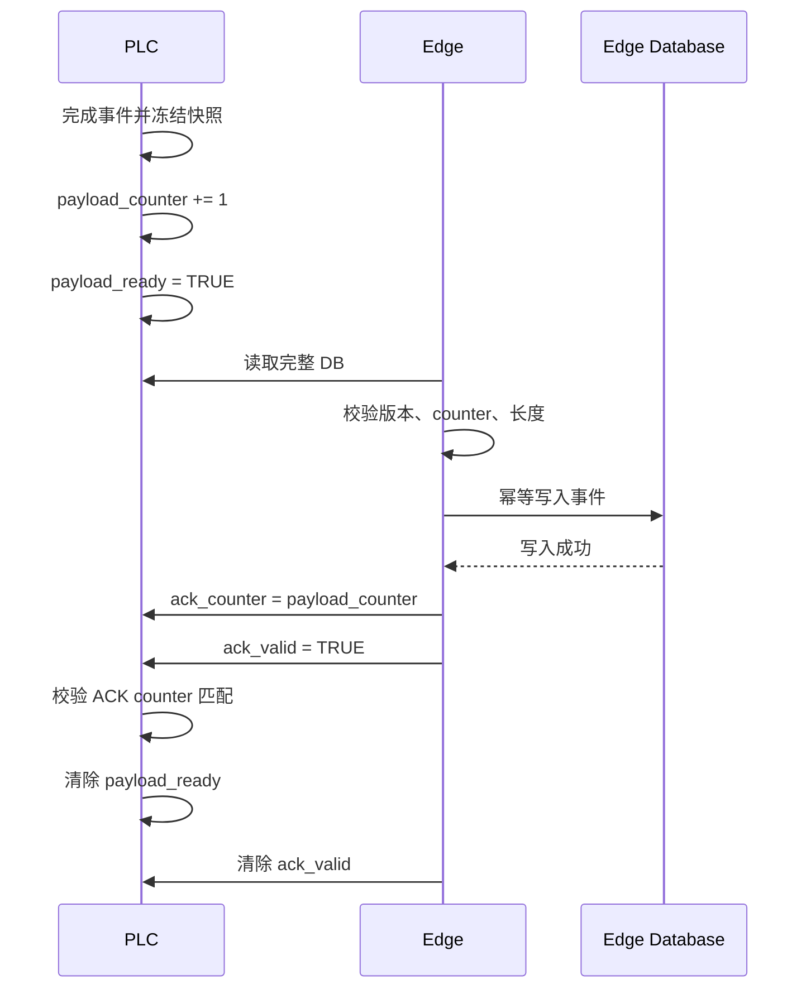

# PLC 与 Edge Collector 接入工程指南

更新时间：2026-06-18  
适用对象：PLC 工程师、自动化工程师、现场调试技师、Edge 系统实施人员  
适用 PLC：Siemens S7-300、S7-1200、S7-1500，以及采用固定 DB 地址映射的兼容设备

## 1. 文档目的

本文档用于指导现场人员为 Edge Collector 设计、编写、配置和验收 PLC 通讯接口。

本文档不是某一台设备的固定地址表，也不规定所有设备必须采集相同的工艺数据。实际接入采用三层结构：

1. **公共协议区**：所有设备必须提供，用于版本、状态、事件、追溯和握手。
2. **可选标准区**：按项目选择，例如参数变更、报警、停机、缓冲区状态。
3. **设备 Payload 区**：由设备工艺决定，例如扭矩、压力、电流、温度、测试结果、视觉结果。

现场项目应基于本指南编制该设备专属的《PLC-Edge 地址映射表》，并由 PLC、Edge、设备工艺三方共同确认。

## 2. 基本原则

### 2.1 一个变量只能有一个写入方

| 变量类别 | PLC | Edge | 说明 |
| --- | --- | --- | --- |
| 工艺数据、状态、结果、计数器 | 写 | 读 | Edge 不得修改设备控制数据 |
| `payload_ready`、`payload_counter` | 写 | 读 | PLC 发布事件 |
| `ack_valid`、`ack_counter` | 读 | 写 | Edge 只写确认区 |
| 参数值 | 写 | 读 | 当前边界下 Edge 不回写 PLC 参数 |
| 参数变更通知 | 写 | 读 | PLC 修改后通知 Edge 重新读取 |

严禁 PLC 和 Edge 同时写同一个字节或同一个 DBW。多个 BOOL 共用一个字节时，也要避免 PLC 与 Edge 分别写该字节中的不同 bit，因为普通字节写入可能覆盖其他 bit。

### 2.2 通讯故障不得直接破坏设备控制

- Edge Collector 不属于安全控制系统。
- 安全回路、急停、互锁和运动控制不得依赖 Edge。
- Edge 离线时，设备是否继续生产应由生产规则决定。
- 默认建议设备继续运行，并使用 PLC 缓冲区、计数器和数据缺口记录处理未采集事件。
- 如业务要求 Edge 离线必须停机，应单独完成风险评估并形成书面规则。

### 2.3 地址发布后必须保持稳定

- 已发布字段不得改变地址、类型、长度、单位或语义。
- 新字段优先追加到预留区或 DB 末尾。
- 不允许在已发布结构中间插入变量，导致后续地址整体移动。
- 不兼容修改必须增加主版本号，并同步修改 Edge mapping。

## 3. 推荐 DB 组织

DB 编号只是示例，现场可以修改，但职责应分离。

| 示例 DB | 名称 | 必选 | 作用 |
| --- | --- | --- | --- |
| DB900 | `EDGE_LINE_STATUS` | 是 | 整线状态、心跳、PLC 启动标识、协议版本 |
| DB901...DB9xx | `EDGE_STATION_EVENT_xx` | 是 | 每个工站的事件快照和设备 Payload |
| DB950 | `EDGE_PARAMETER_SNAPSHOT` | 参数管理时必选 | 当前参数快照和参数变更通知 |
| DB960 | `EDGE_EVENT_BUFFER` | 推荐 | Edge 离线时保存未确认事件 |
| DB970 | `EDGE_DIAGNOSTIC` | 推荐 | 通讯错误、缓冲区、丢失计数 |

规范要求：

- 通讯 DB 与设备内部控制 DB 分离。
- 不要直接让 Edge 大范围读取工艺控制 DB、实例 DB 或安全 DB。
- PLC 程序应在事件完成时，把需要的数据复制到通讯 DB。
- 不同工站可以使用独立 DB，也可以使用一个 DB 中的固定结构数组；最终以映射表为准。

## 4. 数据类型与地址规范

| 业务类型 | 推荐 PLC 类型 | 长度 | 规范 |
| --- | --- | ---: | --- |
| 布尔状态 | BOOL | 1 bit | 仅同一写入方的 BOOL 才能放在同一字节 |
| 状态码、枚举 | UINT/WORD | 2 bytes | 使用数字代码，禁止直接传多语言文本 |
| 普通计数 | UDINT/DWORD | 4 bytes | 明确清零、回绕和断电保持规则 |
| 时间长度 | UDINT/DWORD | 4 bytes | 推荐统一使用毫秒 |
| 测量值 | REAL | 4 bytes | 必须定义单位、小数精度、无效值 |
| 追溯字符串 | STRING[n] | n+2 bytes | 必须固定最大长度和字符集 |
| 时间戳 | DATE_AND_TIME 或约定的 Epoch | 8 或 4 bytes | PLC 与 Edge 必须采用同一编码 |
| 多个错误码 | ARRAY OF UINT | 2×N bytes | 必须同时提供有效数量 |

地址建议：

- WORD/INT 放在偶数地址。
- DWORD/DINT/REAL 建议放在 4 字节边界。
- STRING 必须预留 2 个管理字节。
- 字段之间保留适量 Reserved 区域。
- 禁止使用浮点数表示计数器、状态码和时间戳。

S7 多字节数值按网络字节序排列。Edge 解析 INT、DINT、DWORD、REAL 时必须采用与 Siemens S7 一致的高字节在前规则。

对于 STEP 7 V5.x 的 S7-300 项目，如果工程语言或 CPU 不方便使用 `UINT/UDINT`，可以使用等长的 `WORD/DWORD`，但业务文档必须注明其逻辑值按无符号数解释。禁止因为 PLC 显示为负数就直接修改 counter 原始位模式。

### 4.1 S7 STRING 示例

`STRING[20]` 实际占用 22 bytes：

| 偏移 | 内容 |
| --- | --- |
| DBB0 | 最大长度，固定为 20 |
| DBB1 | 当前字符串长度 |
| DBB2...DBB21 | ASCII 字符数据 |

PLC 工程师必须确认 Edge mapping 中的 `max_length` 与 PLC 声明一致。

## 5. 整线状态 DB 模板

以下地址为推荐模板，不是强制 DB 编号。现场可以整体迁移地址，但字段语义不得模糊。

| 偏移示例 | 变量名 | PLC 类型 | 方向 | 必选 | 中文说明 | 编程要求 |
| --- | --- | --- | --- | --- | --- | --- |
| DBW0 | `protocol_major` | UINT | PLC→Edge | 是 | 协议主版本 | 地址或语义不兼容时递增 |
| DBW2 | `protocol_minor` | UINT | PLC→Edge | 是 | 协议次版本 | 仅追加兼容字段时递增 |
| DBD4 | `heartbeat_counter` | UDINT | PLC→Edge | 是 | PLC 心跳计数 | 建议每秒递增，回绕允许 |
| DBD8 | `plc_restart_counter` | UDINT | PLC→Edge | 推荐 | PLC 重启次数 | 建议断电保持 |
| DBB12 | `plc_boot_id` | STRING[36] | PLC→Edge | 是 | 本次 PLC 运行实例 ID | 每次冷启动变化，本次运行期间不变 |
| DBW50 | `line_status` | UINT | PLC→Edge | 是 | 整线状态码 | 使用统一代码表 |
| DBX52.0 | `auto_mode` | BOOL | PLC→Edge | 推荐 | 自动模式 | 不等同于正在生产 |
| DBX52.1 | `line_running` | BOOL | PLC→Edge | 是 | 整线正在运行 | 需要定义 RUN 判定条件 |
| DBX52.2 | `alarm_active` | BOOL | PLC→Edge | 推荐 | 当前存在报警 | 详细报警通过事件或报警表读取 |
| DBX52.3 | `edge_bypass` | BOOL | PLC→Edge | 可选 | 允许生产但暂停 Edge 采集 | 必须形成数据缺口边界 |
| DBD56 | `program_version` | DWORD | PLC→Edge | 推荐 | PLC 程序版本编码 | 示例 `0x00010005` 表示 1.5 |
| DBW60 | `station_count` | UINT | PLC→Edge | 推荐 | 当前产线工站数 | 用于映射一致性检查 |
| DBW62 | `reserved` | WORD | PLC→Edge | - | 预留 | 必须保持为 0 |

### 5.1 `plc_boot_id` 规范

可选实现：

- 由 PLC 冷启动 OB 生成或更新启动序号。
- 使用 `PLC_ID + restart_counter` 组合生成。
- 老型号无法方便生成 UUID 时，可以使用固定 PLC 编号加断电保持启动计数。

示例：

```text
LINE01-PLC01-00000421
```

Edge 事件幂等键建议采用：

```text
plc_id + station_id + plc_boot_id + payload_counter
```

## 6. 工站事件 DB 模板

### 6.1 公共事件头

| 偏移示例 | 变量名 | PLC 类型 | 方向 | 必选 | 中文说明 | 详细要求 |
| --- | --- | --- | --- | --- | --- | --- |
| DBW0 | `schema_version` | UINT | PLC→Edge | 是 | 当前工站 DB 结构版本 | Edge 读取前校验 |
| DBW2 | `station_status` | UINT | PLC→Edge | 是 | 工站当前状态 | IDLE/RUNNING/WAITING/BLOCKED/ALARM 等 |
| DBD4 | `payload_counter` | UDINT | PLC→Edge | 是 | 事件流水号 | 每发布一个有效事件递增一次 |
| DBX8.0 | `payload_ready` | BOOL | PLC→Edge | 是 | 事件数据已完整准备 | 必须最后置位 |
| DBX8.1 | `cycle_valid` | BOOL | PLC→Edge | 是 | 当前数据构成有效生产履历 | 调试、空循环不得置位 |
| DBX8.2 | `ack_timeout` | BOOL | PLC→Edge | 推荐 | 等待 Edge ACK 超时 | 不应自动覆盖旧 payload |
| DBX8.3 | `buffer_overflow` | BOOL | PLC→Edge | 推荐 | 离线缓冲区溢出 | 同时增加丢失计数 |
| DBX9.0 | `ack_valid` | BOOL | Edge→PLC | 是 | Edge ACK 有效 | 独占一个 Edge 写入字节 |
| DBW10 | `edge_write_reserved` | WORD | Edge→PLC | - | Edge 写入区预留 | 保持为 0，避免与 PLC bit 共用字节 |
| DBD12 | `ack_counter` | UDINT | Edge→PLC | 是 | Edge 确认的事件流水号 | 必须等于 `payload_counter` 才有效 |
| DBD16 | `plc_start_time` | DWORD | PLC→Edge | 是 | 加工开始时间 | 时间编码必须写入项目映射表 |
| DBD20 | `plc_end_time` | DWORD | PLC→Edge | 是 | 加工结束时间 | 必须大于等于开始时间 |
| DBW24 | `result` | UINT | PLC→Edge | 是 | 当前工站结果 | UNKNOWN/OK/NOK/SKIPPED |
| DBW26 | `process_status` | UINT | PLC→Edge | 是 | 当前工序执行状态 | PROCESSED 或 SKIPPED |
| DBW28 | `skip_reason` | UINT | PLC→Edge | 推荐 | 跳过原因 | 上游 NOK、Bypass、工艺不适用等 |
| DBW30 | `nok_code_count` | UINT | PLC→Edge | 推荐 | 有效 NOK code 数量 | 不得超过数组长度 |
| DBW32... | `nok_codes[]` | ARRAY OF UINT | PLC→Edge | 推荐 | 数字故障/质量代码 | 不传中文文本 |
| DBW38 | `alarm_code` | UINT | PLC→Edge | 推荐 | 当前主要报警代码 | 与报警字典对应 |
| DBW40 | `downtime_type` | UINT | PLC→Edge | 推荐 | 停机分类 | 设备、物料、质量、计划停机等 |
| DBD44 | `cycle_time_ms` | UDINT | PLC→Edge | 推荐 | 本工站节拍 | 优先由 PLC 计算，Edge 可复核 |
| DBB50 | `unit_id` | STRING[48] | PLC→Edge | 是 | 工件实例唯一 ID | 工站间必须保持不变 |
| DBB100 | `station_dmc` | STRING[40] | PLC→Edge | 可选 | 本工站扫描或生成的 DMC | 无 DMC 设备可以为空 |
| DBB142 | `final_label_code` | STRING[40] | PLC→Edge | 最终站可选 | 最终产品标签 | 只在形成最终 ID 后填写 |
| DBB184 | `reject_id` | STRING[40] | PLC→Edge | 最终站可选 | 不合格品 ID | 不合格下线时填写 |
| DBW226 | `route_step` | UINT | PLC→Edge | 推荐 | 工艺路线步骤 | 不要求等于工站编号 |
| DBW228 | `route_state` | UINT | PLC→Edge | 推荐 | 工件当前路线状态 | NORMAL/BYPASSING/COMPLETED 等 |
| DBW230 | `defect_origin_station` | UINT | PLC→Edge | 推荐 | 首次缺陷来源工站 | 下游跳过时继续传递 |
| DBW232 | `defect_code` | UINT | PLC→Edge | 推荐 | 首次缺陷代码 | 不应被下游跳过代码覆盖 |
| DBW234 | `payload_length` | UINT | PLC→Edge | 推荐 | 有效通讯区长度 | 用于版本和完整性检查 |
| DBW236...255 | `reserved` | ARRAY OF WORD | PLC→Edge | - | 公共头预留 | 已发布后不得挪作他用 |

偏移只用于展示推荐结构。现场可以根据 S7-300 字符串长度、设备 DB 规划和现有程序调整，但必须把最终绝对地址记录在项目映射表中。

### 6.2 设备自定义 Payload

从公共区之后划分设备 Payload。Payload 没有统一固定字段，应依据设备工艺设计。

| 设备类型 | Payload 示例 | 单位/格式要求 |
| --- | --- | --- |
| 拧紧设备 | 扭矩、角度、拧紧时间、拧紧轴号、程序号 | Nm、deg、ms、数字代码 |
| 压装设备 | 峰值力、最终位移、压装时间、曲线文件 ID | N/kN、mm、ms、STRING |
| 泄漏测试 | 泄漏率、测试压力、稳定时间、测试程序 | Pa/s、kPa、ms |
| 电性能测试 | 电流、电压、电阻、功率、测试步骤结果 | A、V、Ω、W |
| 温度工艺 | 实际温度、设定温度、保温时间 | °C、ms |
| 视觉检测 | 结果、缺陷代码、相机 ID、媒体文件 ID | 数字代码、STRING |
| 搬运工站 | 载具 ID、来源、目标、抓取结果 | 数字代码、STRING |
| 人工工位 | 操作员 ID、确认结果、跳过原因 | 外部账号 ID、数字代码 |

每个 Payload 字段必须在地址表中定义：

| 必填属性 | 示例 |
| --- | --- |
| 变量名 | `press_peak_force_kn` |
| 中文名称 | 压装峰值力 |
| 绝对地址 | `DB901.DBD260` |
| PLC 类型 | REAL |
| Edge 类型 | float |
| 单位 | kN |
| 有效范围 | 0...50 |
| 小数位 | 3 |
| 无效值 | `-1.0` |
| 采样时机 | 压装结束 |
| 是否必填 | 是 |
| 代码表/说明 | 超范围时 result=NOK |

## 7. 事件快照写入顺序

PLC 必须保证 Edge 不会读到半更新数据。

推荐顺序：

1. 确认上一条事件已被 ACK，或者已安全写入 PLC FIFO。
2. 清除本次工作缓冲区中的 `payload_ready`。
3. 在 PLC 内部结构中准备全部公共字段和设备 Payload。
4. 一次性复制到通讯 DB；数据量大时采用双缓冲区。
5. 写入 `payload_counter`、结果、时间和 `payload_length`。
6. 设置 `cycle_valid`。
7. **最后设置 `payload_ready`。**
8. 在收到匹配的 `ack_counter` 前，不得覆盖该快照。

禁止做法：

- 先置 `payload_ready`，再逐个写 Payload。
- 设备运行期间持续修改已发布的结果区。
- 使用一个脉冲 bit 代替保持型 `payload_ready`。
- Edge 未确认时直接用下一件覆盖当前件。

## 8. ACK 状态机

### 8.1 推荐交互



### 8.2 PLC 判定条件

只有满足以下条件才算正确 ACK：

```text
ack_valid = TRUE
AND ack_counter = payload_counter
```

旧 ACK、重复 ACK、counter 不一致的 ACK 不得释放当前快照。

### 8.3 Edge 离线处理

推荐优先级：

1. PLC 环形缓冲区保存最近 N 条事件。
2. 设备控制继续运行。
3. 缓冲区接近满时报警。
4. 缓冲区溢出时增加 `lost_event_count`，记录缺口起止 counter。
5. Edge 恢复后按 counter 顺序补读。

如果 PLC 存储能力不足，至少应保留：

- 最新事件。
- 最新 counter。
- 丢失事件数量。
- 数据缺口开始和结束 counter。

## 9. UID、DMC 与工件流转

### 9.1 标识职责

| 标识 | 用途 | 是否必须跨工站传递 |
| --- | --- | --- |
| `unit_id` | 工件实例主键 | 是 |
| 子件 DMC | 子零件追溯 | 按工艺需要 |
| 最终 Label | 最终总成标识 | 形成后传递 |
| Reject ID | 不合格品标识 | 不合格下线时 |
| Pallet/Carrier ID | 载具跟踪 | 有载具产线时 |
| Batch/Lot ID | 物料批次 | 批次追溯时 |

没有扫码枪或标签的设备仍必须有稳定的工件实例关联方式，可以采用 PLC 生成 UID、载具 ID、工单号加序号等方案。

### 9.2 上游 NOK 规则

| 上游状态 | 当前工站行为 | `process_status` | `result` |
| --- | --- | --- | --- |
| OK | 正常加工 | PROCESSED | OK 或 NOK |
| NOK | 识别工件并跳过加工 | SKIPPED | SKIPPED |
| 未知/数据无效 | 不应默认加工 | 按现场规则 | UNKNOWN |

下游必须继续传递最初的 `defect_origin_station` 和 `defect_code`。跳过原因不能覆盖首个真实缺陷。

## 10. 状态码与错误码

### 10.1 统一原则

- PLC 只传数字代码。
- 中文说明由 Edge 字典或项目文档提供。
- 代码发布后不得改变原语义。
- 废弃代码保留，不重新分配给其他含义。

### 10.2 推荐代码范围

| 范围 | 用途 |
| --- | --- |
| 1...999 | 通用状态、跳过原因 |
| 10000...19999 | 工站 1 或设备功能组 1 |
| 20000...29999 | 工站 2 或设备功能组 2 |
| 30000...39999 | 工站 3 或设备功能组 3 |
| 80000...89999 | 产线级业务异常 |
| 90000...99999 | Edge、通讯、数据质量异常 |

工站数量多或设备结构复杂时，不应机械套用一万一个工站。可以采用：

```text
设备类型 × 10000 + 功能组 × 100 + 具体错误
```

最终编码规则必须形成独立 code table。

### 10.3 通用状态码示例

以下是建议起点，项目可以扩展，但不得在不同设备中让同一个代码代表相反含义。

#### 整线/工站状态

| Code | 英文标识 | 中文说明 | 使用要求 |
| ---: | --- | --- | --- |
| 0 | UNKNOWN | 未知 | 通讯初始化或状态无法确定 |
| 1 | IDLE | 空闲 | 可以生产但当前无加工任务 |
| 2 | RUNNING | 运行 | 正在执行有效生产周期 |
| 3 | WAITING | 等待 | 等待上游、下游、物料或人工 |
| 4 | BLOCKED | 阻塞 | 工件无法向下游流转 |
| 5 | ALARM | 报警 | 存在影响生产的报警 |
| 6 | OFFLINE | 离线 | 工站不可用或通讯不可用 |
| 7 | MANUAL | 手动 | 工站处于手动模式 |
| 8 | MAINTENANCE | 维护 | 维护或调试状态 |

#### 加工结果

| Code | 英文标识 | 中文说明 | 使用要求 |
| ---: | --- | --- | --- |
| 0 | UNKNOWN | 未知 | 尚未形成有效结果 |
| 1 | OK | 合格 | 当前工站正常加工且结果合格 |
| 2 | NOK | 不合格 | 当前工站实际加工并检出不合格 |
| 3 | SKIPPED | 跳过 | 因上游 NOK 或工艺规则未执行本工序 |

#### 工序执行状态

| Code | 英文标识 | 中文说明 |
| ---: | --- | --- |
| 0 | UNKNOWN | 未确定 |
| 1 | PROCESSED | 已执行工序 |
| 2 | SKIPPED | 已识别工件但跳过加工 |

`NOK` 与 `SKIPPED` 必须区分：NOK 表示本工站实际执行并发现不合格；SKIPPED 表示本工站没有执行正常工艺。

## 11. 参数快照 DB 模板

当前系统边界是 Edge 读取和校验参数，不主动回写 PLC。

| 偏移示例 | 变量名 | PLC 类型 | 方向 | 必选 | 中文说明 | 要求 |
| --- | --- | --- | --- | --- | --- | --- |
| DBW0 | `parameter_schema_version` | UINT | PLC→Edge | 是 | 参数结构版本 | 结构变化时更新 |
| DBW2 | `parameter_reserved` | WORD | PLC→Edge | - | 对齐预留 | 保持为 0 |
| DBD4 | `parameter_version` | UDINT | PLC→Edge | 是 | 当前参数版本 | 每次有效修改递增 |
| DBD8 | `parameter_change_counter` | UDINT | PLC→Edge | 是 | 参数变更事件 counter | 用于去重 |
| DBX12.0 | `parameter_changed` | BOOL | PLC→Edge | 是 | 参数已发生修改 | 保持至 Edge 确认 |
| DBX13.0 | `parameter_ack_valid` | BOOL | Edge→PLC | 推荐 | Edge 已读取参数 | Edge 专用写入字节 |
| DBD16 | `parameter_ack_counter` | UDINT | Edge→PLC | 推荐 | Edge 确认的变更 counter | 必须与 change counter 匹配 |
| DBD20 | `parameter_change_time` | DWORD | PLC→Edge | 推荐 | 参数修改时间 | 时间编码统一 |
| DBB24 | `changed_by_id` | STRING[32] | PLC→Edge | 推荐 | PLC/HMI 侧操作员 ID | 实际占用 DBB24...DBB57 |
| DBW58 | `parameter_count` | UINT | PLC→Edge | 是 | 参数项数量 | 不得超过定义上限 |
| DBW60... | `parameter_payload` | STRUCT/ARRAY | PLC→Edge | 是 | 参数值区 | 固定地址或固定参数 ID |

每个参数定义至少包含：

| 属性 | 说明 |
| --- | --- |
| 参数 ID | 稳定数字 ID，不随显示名称变化 |
| 中文名称 | 供技师识别 |
| PLC 变量名 | 工程内符号名 |
| 绝对地址 | Edge 读取地址 |
| 数据类型 | BOOL/INT/DINT/REAL/STRING 等 |
| 单位 | mm、s、bar、A 等 |
| 允许范围 | 最小值、最大值或枚举 |
| 默认值 | 设备标准值 |
| 产品适用范围 | 产品型号或配方 |
| 修改条件 | 运行中允许、停机允许、维护模式允许 |

## 12. 时间、Counter 与重启

### 12.1 时间

- PLC、Edge、HMI 应使用统一 NTP 时间源。
- 项目必须写明采用 UTC Epoch、当地 Epoch 或 Siemens `DATE_AND_TIME`。
- 如果时间无效，提供 `timestamp_valid`。
- PLC 刚启动且尚未完成时间同步时，不得伪造正常时间。

### 12.2 Counter

- 每发布一个有效事件递增一次。
- OK、NOK、SKIPPED 都是有效履历，都应递增。
- IDLE/RUNNING 状态刷新不得递增生产事件 counter。
- 必须定义断电保持、手动清零、最大值和回绕行为。
- Edge 使用无符号比较或 boot ID 分区处理回绕。

### 12.3 PLC 重启

PLC 应提供：

- `plc_boot_id` 或断电保持的 `plc_restart_counter`。
- PLC 程序版本。
- 当前 counter。
- 缓冲区中未确认事件数量。

## 13. S7-1200 / S7-1500 配置

### 13.1 DB 访问方式

如果 Edge 使用 Snap7/S7 绝对地址读取：

- 通讯 DB 使用 Standard access。
- 关闭通讯 DB 的 Optimized block access。
- 设备内部控制 DB 可以继续使用优化访问。
- 在事件完成时，将数据复制到标准通讯 DB。

原因：优化 DB 的绝对偏移不保证稳定，外部按 `DBD/DBW/DBX` 地址读取时必须使用固定布局。

### 13.2 PUT/GET 访问设置

根据 CPU 固件和 TIA Portal 版本，在 CPU 的 Protection & Security / Connection mechanisms 中检查：

- 是否允许远程伙伴使用 PUT/GET 访问。
- CPU 访问级别和密码是否允许目标连接。
- 安全通信设置是否与 Edge 使用的经典 S7 通讯兼容。

只开放项目所需的网络路径，并在工业防火墙或 VLAN 中限制 Edge IP。

### 13.3 常用连接参数

| 系列 | 常见 Rack | 常见 Slot | 说明 |
| --- | ---: | ---: | --- |
| S7-1200 | 0 | 1 | 需以实际硬件组态为准 |
| S7-1500 | 0 | 1 | 需以实际硬件组态为准 |

不得仅凭系列名称硬编码。调试前必须在 TIA Portal 在线诊断和硬件组态中确认。

## 14. S7-300 配置

S7-300 属于较早的 PLC 系列，现场可能使用 STEP 7 V5.x、集成 PN 接口 CPU，或通过 CP343-1 接入工业以太网。接入前必须先识别具体 CPU 和通讯模块订货号。

### 14.1 S7-300 接入前确认表

| 项目 | 现场需要确认的内容 |
| --- | --- |
| CPU 型号 | 例如 CPU 315-2 PN/DP、CPU 314 等 |
| CPU 固件 | 完整固件版本 |
| 工程软件 | STEP 7 V5.x 或 TIA Portal |
| 以太网接口 | CPU 集成 PN，或 CP343-1/CP343-1 Lean |
| CP 型号和固件 | 不同 CP 支持的连接数量和服务不同 |
| IP 地址 | CPU PN 口或 CP 的 IP |
| Rack/Slot | 从 HW Config 确认 |
| 连接资源 | 当前已使用和剩余 S7 连接数量 |
| 访问保护 | CPU 保护级别、通讯权限 |
| DB 空间 | 通讯 DB 和缓冲区所需容量 |

### 14.2 DB 与地址

S7-300 的经典 STEP 7 DB 使用固定绝对地址，不存在 S7-1200/1500 相同形式的 Optimized block access 选项，但仍需遵守：

- 使用独立的全局 DB，不使用实例 DB 作为公开通讯接口。
- 在数据块视图中确认每个变量的绝对偏移。
- 修改 DB 结构后重新核对全部地址。
- WORD 建议偶数对齐，DINT/REAL 建议 4 字节对齐。
- STRING 必须计算 2 个管理字节。
- CPU 存储空间有限，缓冲区大小应按实际型号评估。
- STEP 7 V5.x 项目可以使用 `WORD/DWORD` 承载无符号状态和 counter，Edge mapping 中应按无符号值解码。

### 14.3 网络接入方式

#### CPU 带集成 PN 接口

- 在 HW Config 中确认 CPU PN 接口 IP 和子网。
- Edge 连接 CPU IP。
- 常见 S7-300 CPU 位置为 Rack 0、Slot 2，但必须以实际机架组态为准。
- 检查 CPU 连接资源和访问保护。

#### 使用 CP343-1

- 在 HW Config/NCM S7 中配置 CP 的 IP、子网和通讯参数。
- 将硬件组态下载到 CPU/CP。
- 确认具体 CP 型号支持 S7 communication server 或 PG/OP/S7 服务。
- Edge 连接 CP IP，但目标 CPU 的 rack/slot 仍必须按项目实测确认。
- CP343-1、CP343-1 Lean 和不同固件的连接能力不同，不得只写“CP343-1”而忽略完整订货号。

### 14.4 Rack/Slot

S7-300 常见配置：

```text
Rack = 0
Slot = 2
```

这只是常见值，不是强制值。以下情况可能不同：

- 多机架系统。
- CPU 或 CP 位置不同。
- 第三方网关进行地址转换。
- 通过 CP 建立特定 S7/ISO-on-TCP 连接。

现场必须从 STEP 7 HW Config、NetPro 或设备实际在线诊断确认。

### 14.5 STEP 7 V5.x 程序建议

- 在 OB100 中初始化 boot counter、握手状态和缓冲区状态。
- 使用独立 FB/FC 管理 Edge 通讯，不把逻辑散落在多个 OB。
- 使用共享 DB 作为通讯快照。
- 使用 SFC20 `BLKMOV` 将工作数据复制到通讯快照，减少半更新风险。
- 长数据或多个事件建议使用固定长度 FIFO/环形缓冲区。
- 避免每个扫描周期无条件复制大型 DB，以免增加 PLC scan time。
- 监控 OB1 cycle time 和通讯负载。

### 14.6 S7-300 资源限制

相较 S7-1200/1500，需要更谨慎评估：

- CPU 工作存储器。
- DB 最大长度。
- 同时 S7 连接数量。
- CP343-1 连接资源。
- OB1 扫描周期。
- 大块数据复制时间。
- 字符串和时间处理能力。

推荐先以较小公共头和必要 Payload 上线，再根据压力测试扩展。高频曲线不要写入 PLC 大型 DB，应由 MCU 生成文件交给 Edge。

## 15. Mapping 文件要求

每台设备必须有独立 mapping，禁止在 Collector 代码里硬编码现场地址。

示例：

```yaml
plcs:
  - plc_id: LINE01_PLC01
    host: 192.168.10.20
    port: 102
    rack: 0
    slot: 2
    line_id: LINE01

stations:
  - station_id: WS_PRESS
    db_number: 901
    payload:
      press_peak_force_kn:
        address: DB901.DBD260
        type: real
        unit: kN
      press_final_position_mm:
        address: DB901.DBD264
        type: real
        unit: mm
```

现场映射表必须与 PLC 在线 DB 地址、Edge mapping、交付文档三者一致。

## 16. 网络与安全

- PLC 与 Edge 放在工业 VLAN。
- 只允许指定 Edge IP 访问 PLC TCP 102。
- 禁止 PLC 直接暴露到互联网。
- Edge 只允许写 ACK 区和明确授权的通讯字段。
- 不允许 Edge 写运动、安全、工艺参数和设备动作。
- Safety PLC/F 程序不得依赖 Edge。
- 修改 PLC 访问保护前必须由设备责任人批准。
- 保存修改前后的 PLC 工程备份。

## 17. 现场调试步骤

1. 确认 PLC/CP 型号、固件、IP、rack、slot。
2. 备份 PLC 工程。
3. 核对通讯 DB 为固定地址结构。
4. 核对公共头、Payload、方向和代码表。
5. 使用在线监控确认 PLC 正确写入测试事件。
6. Edge 先以只读模式连接。
7. 对照 raw bytes 和 PLC 在线值。
8. 验证 STRING、REAL、时间戳、数组和有符号类型。
9. 验证数据库幂等写入后，再启用 ACK 写回。
10. 模拟 Edge 断线、重启、ACK 延迟、PLC 重启。
11. 连续生产至少 1000 件，检查缺失、重复、串件。
12. 保存最终 PLC 工程、mapping、代码表和验收记录。

## 18. 交付资料清单

| 交付物 | 必选 | 内容 |
| --- | --- | --- |
| PLC 工程备份 | 是 | 可恢复的 STEP 7/TIA Portal 工程 |
| 硬件清单 | 是 | CPU、CP、固件、订货号 |
| 网络参数表 | 是 | IP、子网、端口、rack、slot |
| DB 地址映射表 | 是 | 字段、中文名、地址、类型、单位、方向 |
| 协议版本记录 | 是 | major/minor 和兼容说明 |
| 状态码与错误码表 | 是 | 数字代码、中文解释、处理建议 |
| UID/工件流转规则 | 是 | 工件如何生成和跨站传递 |
| ACK 状态机 | 是 | 时序图、超时、重试、恢复 |
| Counter 规则 | 是 | 清零、回绕、断电保持 |
| 参数清单 | 使用参数管理时 | 参数 ID、范围、单位、修改条件 |
| 压力测试结果 | 是 | scan time、通讯负载、连续生产测试 |
| 变更记录 | 是 | PLC 和 mapping 的版本历史 |

## 19. 验收标准

- 地址表、PLC 在线地址和 Edge mapping 完全一致。
- 协议版本不一致时，Edge 明确拒绝或报警，不得静默错读。
- 连续生产 1000 件无重复、无串件、无无原因缺站。
- OK、NOK、SKIPPED 履历符合实际工艺规则。
- Edge 重启后不会重复插入已保存事件。
- PLC 重启后不会覆盖旧事件。
- ACK 延迟、错误 ACK、重复 ACK不会释放错误快照。
- Edge 断网时设备按既定策略运行。
- 缓冲区溢出可被检测并形成数据缺口记录。
- 参数修改后 Edge 能读取、校验并记录 changelog。
- PLC scan time 和通讯资源仍在设备允许范围内。

## 20. Siemens 系列差异摘要

| 项目 | S7-300 | S7-1200 | S7-1500 |
| --- | --- | --- | --- |
| 常用工程软件 | STEP 7 V5.x / 部分 TIA | TIA Portal | TIA Portal |
| 通讯 DB | 固定绝对地址 DB | 标准非优化 DB | 标准非优化 DB |
| 优化访问 | 无同类优化 DB 设置 | 通讯 DB 关闭 | 通讯 DB 关闭 |
| 常见 Rack/Slot | 0/2 | 0/1 | 0/1 |
| Ethernet | 集成 PN 或 CP343-1 | 通常集成 PN | 通常集成 PN |
| 资源关注点 | 内存、连接数、CP 能力、scan time | PUT/GET 权限、DB 优化 | 安全设置、DB 优化、连接资源 |
| 推荐缓冲 | 小型固定 FIFO | 固定 FIFO/环形缓冲 | 固定 FIFO/环形缓冲 |

所有 Rack/Slot、连接能力和安全设置都必须以具体 CPU、CP 订货号、固件和实际硬件组态为准。

## 21. 参考资料

- [Siemens Industry Online Support](https://support.industry.siemens.com/)
- [Siemens TIA Portal documentation: Basics of block access](https://docs.tia.siemens.cloud/r/en-us/v20/programming-basics/blocks-in-the-user-program/blocks-with-optimized-access/basics-of-block-access)
- [Siemens S7 communication example, document entry 82212115](https://support.industry.siemens.com/cs/document/82212115/)
- Siemens CP343-1 equipment manual and S7 communication service documentation. The exact manual must match the CP order number and firmware.
- Siemens STEP 7 V5.x system and standard functions manual, including SFC20 `BLKMOV`.

项目实际实施时，应保存所用 CPU/CP 对应版本的 Siemens 官方手册，不能只依赖本指南。
