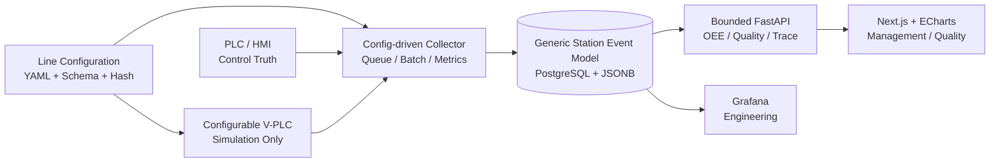

# Edge MES Phase-2 Roadmap

更新时间：2026-06-19  
状态：Phase-2 Architecture Planning
Phase-1 基线：最终验收 PASS，GitHub freeze/tag 已完成

## 1. 当前里程碑

Phase-1 已冻结：

- Freeze commit：`54d7d3286c24535f99a02f00e45448ee73d0b895`
- Tag：`phase1-pass-20260619`
- Release Note：[`releases/phase1_pass_release_note.md`](releases/phase1_pass_release_note.md)
- Push Report：[`reports/github_push_phase1_report.md`](reports/github_push_phase1_report.md)

Phase-2 当前只进行正式架构规划，不修改业务代码、migration、运行配置或远程环境。

## 2. Phase-2 定位

将单线三工站 Demo 演进为：

```text
配置驱动的柔性单线
→ 通用工站事件模型
→ 参数化 V-PLC / Collector
→ OEE / Quality / Trace 产品界面
→ 可审计性能边界
→ Multi-Line 规划
```

PLC/HMI 仍负责设备控制、Hold、Rework、Skip、Manual NOK。Edge 只负责采集、存储、
追溯、OEE、Dashboard 和分析。

## 3. Phase-2 优先级

1. Flexible Line Configuration
2. Generic Station Event Model
3. Configurable V-PLC / Collector
4. OEE API and Dashboard MVP
5. Quality Dashboard / Trace Explorer
6. Hold Event Model
7. Rework Optional
8. Performance and Long-run Validation
9. Multi-Line Planning

详细实施计划：

- [`reports/phase2_flexible_architecture_plan.md`](reports/phase2_flexible_architecture_plan.md)
- [`reports/phase2_sprint_plan.md`](reports/phase2_sprint_plan.md)
- [`reports/phase2_thread_task_plan.md`](reports/phase2_thread_task_plan.md)
- [`reports/dashboard_tech_stack_plan.md`](reports/dashboard_tech_stack_plan.md)

## 4. 目标架构



## 5. Sprint 路线

| Sprint | 目标 | 主责 | 主要 Gate |
| --- | --- | --- | --- |
| 1 | Flexible Line Configuration | Architecture | 3/10/20 站配置可验证 |
| 2 | Generic Station Event Model | Data Quality | 通用表、boot/profile isolation |
| 3 | Configurable V-PLC / Collector | Reliability + Data Quality | 20 站无丢失、ACK 不回归 |
| 4 | OEE API / Dashboard MVP | Frontend + Data Quality | A/P/Q 可复算、Partial OEE |
| 5 | Quality / Trace Explorer | Data Quality + Frontend | 动态路线、payload 下钻 |
| 6 | Hold Event Model | Data Quality + Reliability | 只记录，不控制 |
| 7 | Rework Optional | Data Quality + Reliability | 默认关闭、追加事件 |
| 8 | Performance / Long-run | Verification + Reliability | 明确 Raspberry Pi envelope |
| 9 | Multi-Line Planning | Architecture | 只规划，不实施 |

## 6. MVP 范围

进入 Phase-2 MVP：

- Flexible Line Configuration。
- Generic Station Event Model。
- Configurable V-PLC / Collector。
- OEE API and Dashboard。
- Quality Dashboard / Trace Explorer。

仅模型预留：

- Hold。
- Rework。
- Genealogy。
- downtime/hold loss。
- 高级报告导出。

暂不作为核心：

- Data Gap。
- Missing Unit。

原因：

- Data Gap 依赖 PLC/HMI 对 bypass 和 identity 的明确事实。
- Edge 无法可靠区分 PLC counter 跳号 bug 与真实 Missing Unit。
- 二者保留合同和调查能力，但不挤占 OEE、Quality、Trace 的 Phase-2 主线。

## 7. 延后范围

- Multi-Line 实施。
- Oracle/ERP 真实同步。
- Edge 主动控制 PLC。
- 完整 MRB/审批/电子签名。
- Superset 部署。
- 3D 数字孪生。
- AI 推理和长期媒体库。

## 8. 当前下一步

只启动 Sprint 1：

1. 评审三份 Phase-2 contracts。
2. 创建 3/10/20 工站配置样例和 Schema。
3. 建立 semantic validator 与负例矩阵。
4. 证明 LINE_001 三站 resolved mapping 与 Phase-1 等价。

Sprint 1 gate 通过前，不开始 migration、V-PLC/Collector 动态化或 Dashboard 实现。
