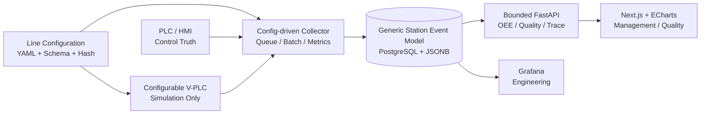

# Edge MES Phase-2 Roadmap

更新时间：2026-07-24
状态：Phase-2 MVP Execution — D2-R7A closed / D2-R7B planning only
Phase-1 基线：最终验收 PASS，GitHub freeze/tag 已完成

## 1. 当前里程碑

Phase-1 已冻结：

- Freeze commit：`54d7d3286c24535f99a02f00e45448ee73d0b895`
- Tag：`phase1-pass-20260619`
- Release Note：[`releases/phase1_pass_release_note.md`](releases/phase1_pass_release_note.md)
- Push Report：[`reports/github_push_phase1_report.md`](reports/github_push_phase1_report.md)

Phase-2 已进入 MVP 实施与验证阶段。当前执行优先级以真实数据链路、生产事实、bounded API、OEE、Quality 与 Trace 数据语义为先；Dashboard/UI 作为最终集成展示面后置验收。

### 1A. 2026-07-23 执行优先级覆盖

本节覆盖旧的“Dashboard runtime evidence 必须先闭环才可继续”的执行顺序，但不改变
PLC/HMI 控制权、Edge 只读采集边界或生产事实合同。

```text
第一优先级：数据真实性与持久化
第二优先级：bounded API 与 OEE / Quality / Trace 语义
第三优先级：最终 Dashboard/UI 集成、演示和浏览器验收
```

Dashboard/UI 的空状态、布局、交互、截图和真实浏览器证据属于非阻塞 acceptance debt。
它们不得被声明为 PASS，仍需在最终集成或发布前完成；但仅 UI 证据缺失不得阻塞数据、
Collector、DB、API、OEE、Quality 或 Trace 主线。

### 1B. 2026-07-24 D2-R7A closeout 与 D2-R7B sequencing

当前 Collector package-closure gate：

```text
D2-R7A:
CLOSED / VERIFIED / COMMITTED / PUSHED

closeout commit:
ddf55be6d1f33f37235789aa28dbdc441ec313a4

final Verification:
D2-R7A-R4-R1 PASS
```

D2-R7A 的 PASS 只证明本地 image/package、non-DB regression、Compose render、container
import/static mapping 和 host/container identity closure。它不证明 remote deployment、
Collector activation、production accepted-fact generation 或 D3。

下一候选 gate：

```text
D2-R7B:
ELIGIBLE FOR PM PLANNING ONLY
NOT AUTHORIZED FOR IMPLEMENTATION
```

D2-R7B 的 recovered objective 是将 exact-HEAD `config/mapping.yaml` 部署到远程
Collector 的只读 config mount source 并验证文件身份。该 gate 必须保持 config deployment
与 Collector restart/activation 分离；planning、professional review、implementation、
independent Verification、PM intake 和 explicit Git closeout 不得合并或自动继承 authority。

## 2. Phase-2 定位

将单线三工站 Demo 演进为：

```text
配置驱动的柔性单线
→ 通用工站事件模型
→ 参数化 V-PLC / Collector
→ OEE / Quality / Trace 产品界面
→ 可审计性能边界
→ Multi-Line 规划
```

PLC/HMI 仍负责设备控制、Hold、Rework、Skip、Manual NOK。Edge 只负责采集、存储、
追溯、OEE、Dashboard 和分析。

## 3. Phase-2 优先级

1. Flexible Line Configuration
2. Generic Station Event Model
3. Configurable V-PLC / Collector
4. Accepted Production Facts and Bounded API Truth
5. OEE / Quality / Trace Data Semantics
6. Final Dashboard / UI Integration and Acceptance
7. Hold Event Model
8. Rework Optional
9. Performance and Long-run Validation
10. Multi-Line Planning

详细实施计划：

- [`reports/phase2_flexible_architecture_plan.md`](reports/phase2_flexible_architecture_plan.md)
- [`reports/phase2_sprint_plan.md`](reports/phase2_sprint_plan.md)
- [`reports/phase2_thread_task_plan.md`](reports/phase2_thread_task_plan.md)
- [`reports/dashboard_tech_stack_plan.md`](reports/dashboard_tech_stack_plan.md)

## 4. 目标架构



## 5. Sprint 路线

| Sprint | 目标 | 主责 | 主要 Gate |
| --- | --- | --- | --- |
| 1 | Flexible Line Configuration | Architecture | 3/10/20 站配置可验证 |
| 2 | Generic Station Event Model | Data Quality | 通用表、boot/profile isolation |
| 3 | Configurable V-PLC / Collector | Reliability + Data Quality | 20 站无丢失、ACK 不回归 |
| 4 | Accepted facts / bounded API truth | Architecture + Data Quality | 生产事实唯一、scope/cursor 合同稳定 |
| 5 | OEE / Quality / Trace data semantics | Data Quality + Reliability | 指标可复算、路线与缺陷关系可信 |
| 6 | Final Dashboard / UI integration | Frontend + Verification | 真实 runtime、固定数据、轻量 smoke 和人工验收 |
| 7 | Hold Event Model | Data Quality + Reliability | 只记录，不控制 |
| 8 | Rework Optional | Data Quality + Reliability | 默认关闭、追加事件 |
| 9 | Performance / Long-run | Verification + Reliability | 明确 Raspberry Pi envelope |
| 10 | Multi-Line Planning | Architecture | 只规划，不实施 |

## 6. MVP 范围

进入 Phase-2 MVP：

- Flexible Line Configuration。
- Generic Station Event Model。
- Configurable V-PLC / Collector。
- Accepted production facts and bounded API truth。
- OEE / Quality / Trace data semantics and calculation contracts。
- Dashboard / UI final integration and acceptance（后置、非阻塞开发、发布前必须完成）。

仅模型预留：

- Hold。
- Rework。
- Genealogy。
- downtime/hold loss。
- 高级报告导出。

暂不作为核心：

- Data Gap。
- Missing Unit。

原因：

- Data Gap 依赖 PLC/HMI 对 bypass 和 identity 的明确事实。
- Edge 无法可靠区分 PLC counter 跳号 bug 与真实 Missing Unit。
- 二者保留合同和调查能力，但不挤占 OEE、Quality、Trace 的 Phase-2 主线。

## 7. 延后范围

- Multi-Line 实施。
- Oracle/ERP 真实同步。
- Edge 主动控制 PLC。
- 完整 MRB/审批/电子签名。
- Superset 部署。
- 3D 数字孪生。
- AI 推理和长期媒体库。

## 8. 当前下一步

当前第一个产品推进动作不是远程部署，而是独立的 D2-R7B Architecture / Integration
planning gate。该 planning 应只恢复和冻结：

1. 目标远程节点及其 authority 来源；
2. 当前 Collector read-only config mount source；
3. exact-HEAD `config/mapping.yaml` 的 bytes、SHA-256、解析后 config hash 与关键身份字段；
4. 远端现有 mapping 的身份、ownership、permissions 和 drift；
5. backup/rollback source、失败停止条件和恢复边界；
6. transport、privilege、SSH 和 remote Docker authority 是否可用；
7. config deployment 与 Collector restart/activation 的严格分离；
8. 是否需要 Reliability、Data Quality 或 Verification preflight。

该 planning gate 不得执行 SSH mutation、remote file copy、Docker/Compose lifecycle、
Collector restart/activation、DB/API mutation、生产数据生成、D3 或 Git stage/commit/push。
任何 remote read、remote mutation、implementation 或 deployment 都需要后续新的显式 PM
和用户授权。

D2-R7B 关闭后，项目再根据真实数据主线选择 OEE、Quality/Pareto 或 Trace relation 的最小
数据语义切片；Dashboard/UI acceptance debt 继续保留到最终集成阶段，不重新打开
Attempt-3 browser evidence 分支。
