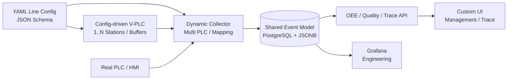

# Edge MES Next-Stage Roadmap

更新时间：2026-06-19  
状态：下一阶段架构路线图  
详细计划：[`reports/next_architecture_plan.md`](reports/next_architecture_plan.md)

## 1. 路线图定位

本文件承接现有 [`task_plan.md`](task_plan.md) 已完成的单线三工站 Demo 阶段，规划
下一阶段的配置化、多工站、多产线、OEE、Quality 和 Genealogy。

控制边界不变：

- PLC 是设备控制大脑。
- Edge 负责采集、存储、追溯、OEE、Dashboard 和分析。
- Edge 不决定 Hold、Rework、Skip/Bypass 或 NOK。
- V-PLC 可以模拟这些事件，但真实项目必须由 PLC/HMI 定义。

## 2. 目标架构

## 3. Sprint Roadmap

| Sprint | 目标 | 主 Thread | 关键交付 | Gate |
| --- | --- | --- | --- | --- |
| 1 | 合同与配置规范 | Architecture / Integration | YAML、Schema、模板、三站兼容样例 | 配置可验证 |
| 2 | 动态 V-PLC | Reliability | 1~N 工站、Buffer、feature flags | 三站行为不回归 |
| 3 | 动态 Collector/DB | Data Quality + Reliability | 多 PLC/mapping、共享模型、动态终站 | 合同先于 migration |
| 4 | OEE/Quality/Trace | Data Quality + Verification | KPI API、动态 Trace、Genealogy 最小模型 | 指标可复算 |
| 5 | Hold/Rework 与多线验收 | Verification 主验收 | 追加事件、报告导出、1~3 线隔离 | Edge 无控制动作 |

## 4. Sprint 1：合同与配置规范

交付：

- `docs/contracts/line_configuration.md`
- `docs/contracts/dynamic_station_model.md`
- `config/schema/line_config.schema.json`
- `config/lines/LINE_001.yaml`
- station/payload/NOK/buffer templates
- 配置验证脚本和负例测试

验收：

- 支持 1、3、15 工站配置样例。
- 当前 WS01/DB101、WS02/DB102、WS03/DB103、DB104 解析等价。
- DB 地址冲突、重复 ID、悬空引用、容量超限会失败。

## 5. Sprint 2：动态 V-PLC

交付：

- 配置驱动的 Line/Station/Buffer runtime。
- 动态 DB 注册和 payload writer。
- 随机/手动 NOK、Hold、Rework 的 simulation-only feature flags。
- 当前 ACK、identity、profile、audit 回归测试。

验收：

- 1~15 工站可启动。
- Hold/Rework 默认关闭。
- 未 ACK payload 不被覆盖。
- DB100 legacy 不变。

## 6. Sprint 3：动态 Collector 与数据模型

交付：

- 多 PLC runtime。
- 每站 1~4 mapping 的 read plan。
- `production_line/plc_config/station_config/buffer_config/plc_db_mapping` 实施计划。
- 动态 terminal station 和共享事件模型。
- DB100 compatibility adapter。

验收：

- 不创建每站独立表。
- WS03 硬编码被配置替代。
- LINE_001 现有数据和 Trace 兼容。
- ACK/counter/gap 唯一性正确。

## 7. Sprint 4：OEE、Quality 与 Genealogy

交付：

- OEE 数据充分性和 A/P/Q 口径合同。
- line/station/shift KPI API。
- 动态 Route Timeline。
- `unit_relation` 最小 Genealogy 模型。
- Grafana 工程 dashboard 更新。
- 自研前端 API contract。

验收：

- 数据不足时不伪造完整 OEE。
- Grafana/API 同窗口结果一致。
- Trace 不固定三工站列。
- Genealogy 关系不按时间猜测。

## 8. Sprint 5：Hold/Rework 与多线验收

交付：

- Hold/Rework 追加事件和投影。
- feature flag 行为。
- JSON/CSV/PDF Trace/Quality 报告。
- 1~3 条线隔离、容量、故障恢复验收。

验收：

- Edge 无 Hold/Release/Rework 控制 API。
- Rework flag 关闭时不生成业务投影。
- 报告包含配置版本、口径和 Data Gap 声明。
- Verification 给出可审计的 PASS/FAIL/BLOCKED。

## 9. 延后项

- Oracle/ERP 真实同步。
- Data Gap 自动补数。
- Missing Unit 自动修正。
- 完整质量审批/MRB/电子签名。
- 复杂权限、多租户。
- 3D 数字孪生、AI 和长期媒体库。

## 10. 当前下一步

下一步只启动 Sprint 1。任何数据库 migration、公共 API 或业务代码实施，必须在相关
合同经 Architecture / Reliability / Data Quality / Verification 共同确认后开始。
