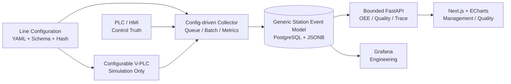

# Edge MES Phase-2 Roadmap

更新时间：2026-07-30
状态：Phase-2 MVP Execution — D2-R7B-I1 implementation package committed and pushed at `934ced7...` / post-closeout status sync WRITTEN / accepted build-image planning next / runtime-loaded and production acceptance not authorized
Phase-1 基线：最终验收 PASS，GitHub freeze/tag 已完成

## 1. 当前里程碑

Phase-1 已冻结：

- Freeze commit：`54d7d3286c24535f99a02f00e45448ee73d0b895`
- Tag：`phase1-pass-20260619`
- Release Note：[`releases/phase1_pass_release_note.md`](releases/phase1_pass_release_note.md)
- Push Report：[`reports/github_push_phase1_report.md`](reports/github_push_phase1_report.md)

Phase-2 已进入 MVP 实施与验证阶段。当前执行优先级以真实数据链路、生产事实、bounded API、OEE、Quality 与 Trace 数据语义为先；Dashboard/UI 作为最终集成展示面后置验收。

### 1A. 2026-07-23 执行优先级覆盖

本节覆盖旧的“Dashboard runtime evidence 必须先闭环才可继续”的执行顺序，但不改变
PLC/HMI 控制权、Edge 只读采集边界或生产事实合同。

```text
第一优先级：数据真实性与持久化
第二优先级：bounded API 与 OEE / Quality / Trace 语义
第三优先级：最终 Dashboard/UI 集成、演示和浏览器验收
```

Dashboard/UI 的空状态、布局、交互、截图和真实浏览器证据属于非阻塞 acceptance debt。
它们不得被声明为 PASS，仍需在最终集成或发布前完成；但仅 UI 证据缺失不得阻塞数据、
Collector、DB、API、OEE、Quality 或 Trace 主线。

### 1B. 2026-07-24 D2-R7A closeout 与 D2-R7B sequencing

当前 Collector package-closure gate：

```text
D2-R7A:
CLOSED / VERIFIED / COMMITTED / PUSHED

closeout commit:
ddf55be6d1f33f37235789aa28dbdc441ec313a4

final Verification:
D2-R7A-R4-R1 PASS
```

D2-R7A 的 PASS 只证明本地 image/package、non-DB regression、Compose render、container
import/static mapping 和 host/container identity closure。它不证明 remote deployment、
Collector activation、production accepted-fact generation 或 D3。

下一候选 gate：

```text
D2-R7B:
ELIGIBLE FOR PM PLANNING ONLY
NOT AUTHORIZED FOR IMPLEMENTATION
```

D2-R7B 的 recovered objective 是将 exact-HEAD `config/mapping.yaml` 部署到远程
Collector 的只读 config mount source 并验证文件身份。该 gate 必须保持 config deployment
与 Collector restart/activation 分离；planning、professional review、implementation、
independent Verification、PM intake 和 explicit Git closeout 不得合并或自动继承 authority。

### 1C. 2026-07-28 D2-R7B-I1 R27 local contract closeout and remote re-entry boundary

R27 local implementation、Reliability 与 Verification 已闭环：R27-R3 implementation、
R27-R4 Reliability re-review 与 R27-R5 Verification 均为 PASS，R27 local contract gate
为 `CLOSED / PM-VERIFIED`。R27-R2 scope reset 下批准的 threat model 是：

```text
one authorized orchestrator
one owned SSH child per phase
persisted manifest-bound helpers
no concurrent untrusted same-directory writer
postflight remains final deployed-identity authority
```

`REL-R27-R2-UPLOAD-001` 与 `REL-R27-R2-DEPLOY-001` 是 deferred、non-blocking
hardening backlog；`REL-R27-R2-ORCH-001` 已 closed。source、tests、manifests 与 R27
reports 仍未 committed，D2-R7B remote deployment 尚未关闭。R26 仅为 historical evidence，
current remote state 未观察；当前不存在 cleanup、eligibility、deployment、restart 或
activation authority。Git closeout 必须先于任何新的 remote execution authority，且上述
authority 不能从 R27 的 PASS 或本 roadmap 自动继承。

### 1D. 2026-07-28 D2-R7B-I1 R29-R2 / R29-R2-R1 docs-only closeout repair

R28-R1 与 R28-R1-R1 的 read-only remote re-entry 均为 `HOLD / SSH 0 / remote NOT_OBSERVED`，属于 fail-closed gate/tooling history，不是 Raspberry Pi 或 Collector failure。R28-R2 为 `PASS / PM-VERIFIED / PM-ACCEPTED / RETAINED_R26_UPLOAD_IDENTITY_PROVEN`，R29-R1 为 `PASS / PM-VERIFIED / PM-ACCEPTED / EXACT_R26_UPLOAD_SIDECAR_REMOVED`。

原始 R29-R2 attempt 为 `HOLD / PM-VERIFIED / PM-ACCEPTED AS FAIL-CLOSED DOCS WRITE`，原因包括两个 literal plus headings、report conclusion/hash inconsistency 与 roadmap Section 8 未更新。R29-R2-R1 是使用新独立 authority 的 docs-only repair；其 PASS 仅表示 docs consistency restored，不代表 Git closeout、fresh eligibility、deployment、restart 或 activation。R29-R2-R1 artifacts 仅建立 `WRITTEN`。

接受的 cleanup boundary 保持不变：remote target 仍为 `OLD_EXACT`，5935 bytes，SHA-256 `86af360ae3aeae603a97add4150245dcfe9b58dbcf9c44fe3a79a62ba82604c3`；R26 upload sidecar 已删除；matching D2-R7B sidecars `0`；backup 与 rollback temp 均 `ABSENT`；Collector identity、running state、image、restart count、started_at 与 read-only bind mount unchanged。没有 fresh eligibility、new config deployment、restart、activation、runtime-loaded validation 或 production acceptance。

该 section 保留 data-first MVP 与 deferred UI acceptance policy；status、roadmap 与 report 都不授予下一阶段 authority。

### 1E. 2026-07-29 D2-R7B-I1 package-closed image load scope-reset acceptance

ChatGPT PM 已完成独立 scope-reset governance decision：

```text
docs/reports/sprint4_d2_r7b_i1_pm_scope_reset_governance_decision_image_loaded_exact.md

PASS
PM_SCOPE_RESET_ACCEPTS_R32_R5_R2_IMAGE_LOADED_EXACT
```

当前接受的最小产品事实：冻结源码生成并完成本地 package-closure 验证的 Linux/arm64 Collector image，已通过 archive transport/load，以与 archive config、ordered Env 和九项 ordered RootFS 完全一致的 Docker object存在于远端。Descriptive tag 指向该 object；compatibility tag 仍指向旧安全 image；known-bad image不持有 descriptive tag；reconciliation mutation为零。

现接受：

```text
LOCAL_PACKAGE_CLOSED_IMAGE_VALIDATION_PASS
IMAGE_ARCHIVE_IDENTITY_VERIFIED
IMAGE_TRANSPORT_IDENTITY_VERIFIED
REMOTE_DOCKER_LOAD_COMMAND_PASS
DESCRIPTIVE_TAG_READY
REMOTE_LOADED_OBJECT_CONTENT_RECONCILED
IMAGE_LOADED_EXACT
```

仍未建立：

```text
ACTIVATION_ELIGIBLE
ACTIVATED
RUNTIME-LOADED
PRODUCTION-ACCEPTED
```

R32-R5-R2 原始 terminal schema HOLD 与 R32-R5-R3/R4/R5 normalization HOLD 均保留为历史过程事实，但不再阻塞 `IMAGE_LOADED_EXACT`。依据 PM Rule Sections 12–13，normalization runner repair chain 已 `CLOSED / SUPERSEDED`；新的 R32-R5-R6 runner repair不授权。Generic evidence-normalization/audit framework移出当前 MVP，未来如有需要必须作为独立 Level 2 项目。

本 scope reset 没有新的 remote observation，也不授权 network、SSH、tag mutation、Collector lifecycle、rollback、cleanup 或 Git action。R31 activation phase separation继续有效：必须先完成 exact-path Git closeout，随后由用户单独授权 fresh read-only remote activation preflight。

### 1F. 2026-07-30 D2-R7B-I1 runtime-loaded observability implementation package acceptance

R40–R47 已完成 process-bound runtime-loaded observability 的 planning、Reliability、
Architecture、Data Quality 与 Verification planning chain；R41 与 R44 的历史 HOLD
分别由 R42/R43 与 R45/R46 的 bounded closure supersede，不删除历史 blocker origin。
R48 implementation、R49 pre-record DB ordering repair、R50 Reliability review、R51
Data Quality review、R52 historical Verification HOLD、R53 oracle closure repair 与
R54 independent Verification re-review 的状态为：

```text
R48  WRITTEN / TESTED / PM-ACCEPTED
R49  WRITTEN / TESTED / PM-ACCEPTED
R50  PASS WITH RECOMMENDATIONS / PM-ACCEPTED
R51  PASS WITH RECOMMENDATIONS / PM-ACCEPTED
R52  HOLD / PM-ACCEPTED AS HISTORICAL HOLD
R53  WRITTEN / TESTED / PM-ACCEPTED
R54  PASS WITH RECOMMENDATIONS / PM-ACCEPTED; no current Verification blocker
```

R52→R53→R54 closure 已完成：R52 的 V-B1–V-B4 oracle blocker 由 R53 test-only
closure repair 补强，并由 R54 独立复核关闭。ChatGPT PM final
implementation-package acceptance 为 `YES`，故本地 package 为
`GIT-CANDIDATE-ELIGIBLE = YES`；但 `GIT-CANDIDATE-ACCEPTED`、`STAGED`、
`COMMITTED`、`PUSHED` 均仍为 `NO`。

产品/evidence 边界保持：

```text
ACTIVATED                  = YES
STATIC_MAPPING_INITIALIZED = YES
RUNTIME-LOADED             = NO
PRODUCTION-ACCEPTED        = NO
```

本节不把 runtime evidence、A–H、deployment、lifecycle 或 production acceptance
描述为已完成；strict RFC3339 与 direct line-plan/station-runtime fixture 仍是
bounded non-blocking backlog。Oracle/ERP 真实同步与 `sync-worker` 仍保留在延后范围，
不改变 Phase-2 功能优先级。

### 1G. 2026-07-30 D2-R7B-I1 exact Git closeout and next-gate reset

R55冻结的exact 24-path candidate已由ChatGPT PM在用户明确授权下完成stage、commit与
push。当前Git authority为：

```text
commit:
934ced7b9659cb566628b1709cf6d73463a534d8

message:
Accept runtime-loaded observability implementation

HEAD == origin/main:
YES

ahead / behind:
0 / 0

committed path count:
24 exact paths
```

提交前`py_compile`、Reliability focused tests（`25 passed, 11 subtests passed`）、
runtime-source focused tests（`59 passed`）和cached diff check均PASS。提交后tracked与
cached diff为空；保留未跟踪集合为`301 = Batch D 300 + Batch E 1`，unknown/missing
为`0/0`。

当前状态：

```text
FINAL-IMPLEMENTATION-PACKAGE-ACCEPTED = YES
GIT-CANDIDATE-ACCEPTED                = YES
COMMITTED                             = YES
PUSHED                                = YES

BUILT                                 = NO
DEPLOYED                              = NO
ACTIVATED                             = YES
STATIC_MAPPING_INITIALIZED            = YES
RUNTIME-LOADED                        = NO
PRODUCTION-ACCEPTED                   = NO
```

既有`ACTIVATED`和`IMAGE_LOADED_EXACT`不能作为新commit `934ced7...`已构建、部署或加载
的证据。下一Gate必须重新从该commit建立source-to-image authority。

最小下一Gate是独立Level 2 accepted build/image gate planning。Planning必须冻结：

- exact source commit和clean tracked baseline；
- Docker build context、Dockerfile、requirements及其它输入身份；
- Linux/arm64目标和builder环境边界；
- image tag、config digest、archive digest及provenance；
- local build/package validation；
- build、archive transport、remote load、deployment、activation的authority分离；
- 失败停止、rollback与禁止继承规则。

本post-closeout同步只建立`WRITTEN`，不授权actual build、Docker、network、remote load、
deployment、restart、activation、runtime A–H或production acceptance。

## 2. Phase-2 定位

将单线三工站 Demo 演进为：

```text
配置驱动的柔性单线
→ 通用工站事件模型
→ 参数化 V-PLC / Collector
→ OEE / Quality / Trace 产品界面
→ 可审计性能边界
→ Multi-Line 规划
```

PLC/HMI 仍负责设备控制、Hold、Rework、Skip、Manual NOK。Edge 只负责采集、存储、
追溯、OEE、Dashboard 和分析。

## 3. Phase-2 优先级

1. Flexible Line Configuration
2. Generic Station Event Model
3. Configurable V-PLC / Collector
4. Accepted Production Facts and Bounded API Truth
5. OEE / Quality / Trace Data Semantics
6. Final Dashboard / UI Integration and Acceptance
7. Hold Event Model
8. Rework Optional
9. Performance and Long-run Validation
10. Multi-Line Planning

详细实施计划：

- [`reports/phase2_flexible_architecture_plan.md`](reports/phase2_flexible_architecture_plan.md)
- [`reports/phase2_sprint_plan.md`](reports/phase2_sprint_plan.md)
- [`reports/phase2_thread_task_plan.md`](reports/phase2_thread_task_plan.md)
- [`reports/dashboard_tech_stack_plan.md`](reports/dashboard_tech_stack_plan.md)

## 4. 目标架构


```mermaid
flowchart LR
  Config["Line Configuration<br/>YAML + Schema + Hash"]
  PLC["PLC / HMI<br/>Control Truth"]
  VPLC["Configurable V-PLC<br/>Simulation Only"]
  Collector["Config-driven Collector<br/>Queue / Batch / Metrics"]
  DB[("Generic Station Event Model<br/>PostgreSQL + JSONB")]
  API["Bounded FastAPI<br/>OEE / Quality / Trace"]
  UI["Next.js + ECharts<br/>Management / Quality"]
  Grafana["Grafana<br/>Engineering"]

  Config --> VPLC
  Config --> Collector
  PLC --> Collector
  VPLC --> Collector
  Collector --> DB
  DB --> API
  API --> UI
  DB --> Grafana
```

## 5. Sprint 路线

| Sprint | 目标 | 主责 | 主要 Gate |
| --- | --- | --- | --- |
| 1 | Flexible Line Configuration | Architecture | 3/10/20 站配置可验证 |
| 2 | Generic Station Event Model | Data Quality | 通用表、boot/profile isolation |
| 3 | Configurable V-PLC / Collector | Reliability + Data Quality | 20 站无丢失、ACK 不回归 |
| 4 | Accepted facts / bounded API truth | Architecture + Data Quality | 生产事实唯一、scope/cursor 合同稳定 |
| 5 | OEE / Quality / Trace data semantics | Data Quality + Reliability | 指标可复算、路线与缺陷关系可信 |
| 6 | Final Dashboard / UI integration | Frontend + Verification | 真实 runtime、固定数据、轻量 smoke 和人工验收 |
| 7 | Hold Event Model | Data Quality + Reliability | 只记录，不控制 |
| 8 | Rework Optional | Data Quality + Reliability | 默认关闭、追加事件 |
| 9 | Performance / Long-run | Verification + Reliability | 明确 Raspberry Pi envelope |
| 10 | Multi-Line Planning | Architecture | 只规划，不实施 |

## 6. MVP 范围

进入 Phase-2 MVP：

- Flexible Line Configuration。
- Generic Station Event Model。
- Configurable V-PLC / Collector。
- Accepted production facts and bounded API truth。
- OEE / Quality / Trace data semantics and calculation contracts。
- Dashboard / UI final integration and acceptance（后置、非阻塞开发、发布前必须完成）。

仅模型预留：

- Hold。
- Rework。
- Genealogy。
- downtime/hold loss。
- 高级报告导出。

暂不作为核心：

- Data Gap。
- Missing Unit。

原因：

- Data Gap 依赖 PLC/HMI 对 bypass 和 identity 的明确事实。
- Edge 无法可靠区分 PLC counter 跳号 bug 与真实 Missing Unit。
- 二者保留合同和调查能力，但不挤占 OEE、Quality、Trace 的 Phase-2 主线。

## 7. 延后范围

- Multi-Line 实施。
- Oracle/ERP 真实同步。
- Edge 主动控制 PLC。
- 完整 MRB/审批/电子签名。
- Superset 部署。
- 3D 数字孪生。
- AI 推理和长期媒体库。

## 8. 当前下一步

当前下一步唯一为post-closeout治理交接与accepted build/image gate planning：

1. 本次`docs/current_status.md`与`docs/roadmap.md`小型同步保持`WRITTEN / UNSTAGED / UNCOMMITTED / UNPUSHED`。
2. 立即生成新的ChatGPT PM handoff，冻结commit `934ced7...`、301项已分类untracked集合、当前状态边界和下一Gate的Level 2风险。
3. 用户单独授权后，只对本次状态同步与新handoff执行exact-path docs-only Git closeout；不得`git add .`、`git add -A`、`git add docs/`或吸收Batch D/E。
4. 新PM窗口先执行read-only recovery，再发布独立accepted build/image gate planning；不得从本roadmap直接执行build、Docker或remote操作。
5. Planning被PM接受后，后续仍依次为actual build/image gate → deployment/lifecycle gate → bounded runtime-loaded A–H validation → PM `RUNTIME-LOADED` acceptance → separate production accepted-fact work。
6. 旧的`IMAGE_LOADED_EXACT`/activation建议在1E及历史status段落中保留，但不能证明新commit已构建或已部署。

D2-R7B 关闭后，项目再根据真实数据主线选择 OEE、Quality/Pareto 或 Trace relation 的最小数据语义切片；Dashboard/UI acceptance debt继续保留到最终集成阶段，不重新打开 Attempt-3 browser evidence 分支。
